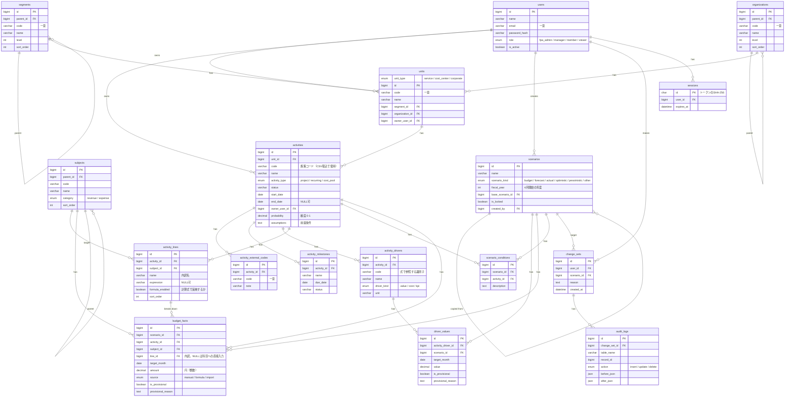

# 活動ベース予実管理/ローリングフォアキャスト支援アプリ

## 1. システム概要・設計思想

### 1.1 背景と課題

> TODO（オーナー記入）: 現状の予実管理の課題を記載する。論点の例：
> - 見込金額が「数字だけ」で共有され、根拠（施策・ドライバー）が追えない
> - 見込の変更理由が残らず、前回見込との差異説明に工数がかかる
> - 楽観/悲観の幅や案件の確度が可視化されていない

### 1.2 アプリの目的

1. 根拠の透明性の向上
2. リスク感度の向上
3. 説明責任の充実度の向上

①根拠の透明性＝見込金額（売上/費用/利益）の計算根拠の充実度
・構成する施策/案件
・バリュードライバーやコストドライバー、KPIなどの分解値（現状と見込）

②リスクの感度＝見込金額（売上/費用/利益）
・構成する施策/案件や売上・費用の発生確度
・構成する施策/案件の前提条件やスケジュール/マイルストーン
・楽観/悲観シナリオの想定内容と発生条件

③説明責任の有無
・各種の設定値
・変更の履歴
・仮の値を使用して計算した場合の設定値の理由説明
・見込や予定を変更した場合の変更の理由説明

目的とデータモデルの対応：

| 目的         | 対応するデータ                                                                                     |
| ------------ | -------------------------------------------------------------------------------------------------- |
| ①根拠の透明性 | `activities`、`activity_drivers`、`driver_values`、`activity_lines`                             |
| ②リスクの感度 | `activities.probability`・`assumptions`、`activity_milestones`、`scenario_conditions`、楽観/悲観シナリオ |
| ③説明責任     | `is_provisional`・`provisional_reason`、`change_sets`、`audit_logs`                                |

### 1.3 アプリの本質と特徴

> TODO（オーナー記入）: 論点の例：
> - 金額ではなく「活動（施策）」を管理の主語にする
> - 金額はドライバー × 前提条件の結果として扱い、数字の背後にある理由を残す
> - ローリングフォアキャストのたびに「何が・なぜ変わったか」を説明できる

## 2. ドメインモデルの設計方針

このアプリでは、活動（施策）単位をメインの管理対象として扱う。活動（施策）には収益を伴う活動と支出のみの活動に分けられ、収益を伴う活動はさらに”プロジェクト型”と”運用型”に分けられる。収益を伴う活動のタイプの違いは収益・コストのドライバー、予測の確度、パフォーマンス管理項目の違いとして現れる。

| タイプ             | `activity_type` | 期限               | 典型的なドライバー（例）                                   | 主な管理項目                     |
| ------------------ | --------------- | ------------------ | ---------------------------------------------------------- | -------------------------------- |
| プロジェクト型     | `project`       | あり               | 案件金額、受注確度、工数 × 単価、マイルストーン別売上計上 | 受注確度、マイルストーン進捗     |
| 運用型             | `recurring`     | なし（NULL可）     | 顧客数 × ARPU、解約率、インプレッション × 単価             | KPIの推移（顧客数・解約率など）  |
| コストプール型     | `cost_pool`     | 設定を推奨         | 人数 × 単価、固定費                                        | ゴール・期限の達成状況、費用消化 |

### 2.1 プロジェクト型（フロー型/投資・案件）

フロー型と呼ばれる案件で、有期限的なプロジェクトタイプの活動（施策）である。開発の受託やコンサル案件などがこれに該当する。

### 2.2 運用型（ストック型/継続収益・運用）

ストック型と呼ばれる案件で、明確な期限（案件の終了）の設定はないような活動（施策）である。Saas収益やネットワーク広告収益のほか、継続的な商品販売もこちらに該当する。

### 2.3 コストプール/ルーティン型（機能維持・共通経費）

基本的に収益を伴わない活動（施策）である。活動管理としては期限やゴールを設定して管理することが望ましい。

### 2.4 金額の内訳と計算式（activity_lines）

同じ施策の中でも、ドライバーから計算したい金額と、直接入力したい金額が混在する。また、1つの科目が複数の要素からなることもある（例: 売上高 = 月額利用料 + 初期導入費 + スポット売上）。そのため、金額の入れ方は施策単位ではなく、**施策 × 科目の下の「内訳」（`activity_lines`）ごと**に決める。

- 内訳は名前を持ち、1つの施策 × 科目に複数登録できる（施策 × 科目 × 名前で一意）。
- 内訳ごとに計算式を持てる。計算式で**反映する**（`formula_enabled`）か、**しない**（直接入力）かを選ぶ。反映しない場合も、式は参考として残せる。
- **科目の金額 = 内訳の金額の合計 + 科目への直接入力（内訳なし）の金額**。内訳を作らない科目は、これまでどおり科目に直接入力する。
- `budget_facts.line_id` で内訳を指す（NULL は科目への直接入力）。実績は科目単位で取り込む（`line_id` は NULL）。予実比較・リスクなどの集計も科目単位。
- 計算式で反映する内訳は、ドライバーの月次値（`driver_values`）と式から金額を算出し、`source = 'formula'` で保存する。直接入力はできない。
  - 例: 月額利用料 = `unit_price * customers * probability`
  - 式は四則演算・括弧・数値リテラル・ドライバーの `code` 参照のみをサポートする。`probability` は予約語で、施策の確度（`activities.probability`）を参照する。
  - 計算は有理数（誤差なし）で行い、金額にするときに円未満を四捨五入する。
  - ドライバー値を保存したとき、確度を変更したとき、計算式や反映の有無を変更したときに金額を再計算する。再計算の対象はロックされていない実績以外のシナリオ（確定した版は変わらない）。
  - 計算に必要なドライバー値がそろわない月は金額を持たない。仮の値のドライバーを使った金額は、仮の値として扱う。
- 反映をやめた内訳の金額はそのまま残り、以後は直接入力で編集できる。
- 内訳を削除すると、各シナリオのその内訳の金額も削除する。ロック済み・実績のシナリオに金額がある内訳は削除できない（反映しない設定にする）。
- ドライバーは、いずれかの内訳の式（反映しない式を含む）で使われている間は、コード変更・削除ができない。

### 2.5 施策コードと外部コード

- **施策コード**はアプリが発行する、施策を指す番号。作成時に空欄なら `ACT-0001` 形式で自動採番する（手入力も可）。
- **外部コード**は、会計・基幹システムで発行された案件番号など。期初の計画時点では存在しないため、案件化（受注・稼動開始）したときに施策に登録する。
  - 施策に0個以上。計画段階の施策は外部コードなし。
  - 「新規受託 3件想定」のような**枠の施策**には、実際の案件の外部コードを複数登録し、実績を枠で受ける（期中に計画施策を分割しない）。
  - 1つの外部コードは1つの施策にだけ紐づく（実際の案件が複数の計画施策にまたがらない）。付け替える場合は外してから登録し直す。
  - 実績 CSV の `activity_code` には、施策コードと外部コードのどちらも使える。取り違えを防ぐため、外部コードと施策コードは同じ値にできない。
  - 外部コードを外しても、取込済みの実績は施策に残る。
- 計画になかった案件が期中に発生した場合は、施策を新しく作って外部コードを登録する。

### 2.6 シナリオ

- シナリオは1軸で管理する。予算・見込の版（例: 「2026年度 当初予算」「2026-10時点見込」「2026-11時点見込」）や楽観/悲観、実績もすべてシナリオとして登録する。
- シナリオ名は自由に設定できる。比較や集計のために種別（`scenario_kind`）を持つ。
- シナリオの作成・ロックは FP&A（`fpa_admin`）のみが行える。
- 新しい見込シナリオは既存シナリオを複製して作成する（`base_scenario_id` に複製元を記録）。
- ロック済み（`is_locked = true`）のシナリオは編集できない。実績シナリオ（`scenario_kind = 'actual'`）は取込でのみ更新する。
- ロック解除には変更理由が必須。
- シナリオの複製は同じ年度のシナリオからのみ行え、ドライバー値・金額・想定条件をすべて複製する。実績シナリオは複製では作成できない。
- 数値を入力できる月は、シナリオの年度（4月〜翌3月）の12か月。
- シナリオは削除できない（変更履歴がシナリオを参照するため）。名称は変更できる。

### 2.7 変更履歴と説明責任

- 値の変更は必ず「変更セット」（`change_sets`）単位で行う。変更理由（`reason`）は次の変更で必須とし、それ以外（マスタの変更など）では任意とする。
  - 金額・ドライバー値の変更
  - 施策の確度・前提条件・期間（開始日/終了日）の変更
  - 内訳の計算式・反映の有無の変更（計算式で反映する内訳の登録を含む）、内訳の削除
  - マイルストーンの期日変更・削除
  - 施策の削除
- 各テーブルの変更前後の値は監査ログ（`audit_logs`）に JSON で残し、変更セットに紐づける。
- 仮の値を使った場合は `is_provisional = true` とし、`provisional_reason` に理由を記録する。

## 3. ドメインモデル

### 3.1 エンティティ

| エンティティ          | 説明                                                                                                  |
| --------------------- | ----------------------------------------------------------------------------------------------------- |
| `activities`          | 施策マスタ。施策コード・タイプ・期間・確度・前提条件を持つ。1つのユニット（`unit`）に所属する。 |
| `activity_external_codes` | 施策の外部コード（会計・基幹システムの案件番号など）。施策に0個以上。                             |
| `activity_milestones` | 施策のマイルストーン。                                                                                |
| `activity_drivers`    | 施策のドライバー定義（バリュードライバー / コストドライバー / KPI）。                                 |
| `driver_values`       | ドライバーの月次値。シナリオごとに持つ。                                                              |
| `activity_lines`      | 施策 × 科目の金額の内訳。名前・計算式・計算式で反映するか（`formula_enabled`）を持つ。                  |
| `budget_facts`        | 金額データのファクトテーブル。年月（target_month）・科目（subject）・施策（activity）・金額（amount）と `scenario` を持つ。内訳（`line_id`、NULL は科目への直接入力）を持てる。 |
| `scenarios`           | シナリオマスタ。予算・見込の版、楽観/悲観、実績を含む。                                               |
| `scenario_conditions` | シナリオ × 施策ごとの想定内容と発生条件（楽観/悲観の根拠）。                                           |
| `units`           | ユニットマスタ。施策を束ねる単位。種別（サービス／共通費／管理部門）を持つ。セグメントと組織の末端ノードに1つずつ所属する。 |
| `segments`            | 事業マスタ。ポートフォリオ管理のための階層構造を表現した集計軸。ツリー構造（parent_id）を持つ。        |
| `organizations`       | 組織マスタ。ツリー構造（parent_id）および階層レベルを持つ。                                           |
| `subjects`            | 勘定科目マスタ。P/Lを構成する営業収益・営業費用のカテゴリを持つ。                                      |
| `users`               | ユーザー。ロールと有効/無効を持つ。                                                                   |
| `sessions`            | ログインセッション。トークンのハッシュと有効期限を持つ。                                              |
| `change_sets`         | 変更セット。まとめて行った変更の単位と変更理由。                                                      |
| `audit_logs`          | 監査ログ。レコード単位の変更前後の値。                                                                |

### 3.2 階層構造

施策（`activity`）を束ねる単位を、本アプリでは**ユニット**（`unit`）と呼びます。当初は「機能」（`function`）と呼んでいましたが改称しました。
ユニットは基本的に「サービス」ですが、「○○事業共通経費」のようなプロフィットセンターではない箱や、「人事部」のような組織名そのままの箱もあり得るため、種別で区別します。

| 種別（`unit_type`） | 意味 | 例 |
| ------------------- | ---- | -- |
| `service`（サービス） | 収益を生むユニット（プロフィットセンター） | SaaS Aサービス、受託開発 |
| `cost_center`（共通費） | 事業の共通経費をまとめる箱（コストセンター） | ○○事業共通経費 |
| `corporate`（管理部門） | 管理部門の箱 | 人事部、経理部 |

予実比較やリスクの画面では、種別で絞り込める（例: サービスだけで利益を比べる）。

ユニットよりも大きい単位は、"セグメント"と"組織"の2軸を用意してあります。セグメント・組織それぞれ階層構造を表現しますが、どちらも多段階での階層を設定可能です。
1つのユニットは、セグメントの末端ノード1つと組織の末端ノード1つに所属します。

```
* セグメント軸での階層
segment（セグメント）
  └ ...
    └ ...
      └ ...
        └ unit（ユニット）
          └ activity（施策）
例)
XXX事業 (segment)
  └YYYサービス (unit)
    └ 施策 (activity)

* 組織軸での階層
organization（組織）
  └ ...
    └ ...
      └ ...
        └ unit（ユニット）
          └ activity（施策）
例)
AAA本部 (organization)
  └BBB部 (organization)
    └CCC課 (unit)
      └ 施策 (activity)
```

### 3.3 ER図



### 3.4 主な制約

- `budget_facts`: (scenario_id, activity_id, subject_id, line_id, target_month) で一意（line_id の NULL は 0 として扱う）
- `driver_values`: (activity_driver_id, scenario_id, target_month) で一意
- `activities`: code で一意
- `organizations` / `segments` / `units`: code で一意（作成時に空なら ORG-0001 / SEG-0001 / UNIT-0001 形式で自動採番。CSV の取込で行を結びつけるキー）
- `subjects`: code で一意
- `activity_drivers`: (activity_id, code) で一意
- `activity_lines`: (activity_id, subject_id, name) で一意。計算式で反映する内訳は式が必須
- `scenario_conditions`: (scenario_id, activity_id) で一意
- `target_month` は月初日（例: `2026-10-01`）で保持する
- `users.email` は一意
- `units.segment_id` / `organization_id` は末端ノード（子を持たないノード）のみ指定可（アプリ側で検証する）

## 4. ロール

| 操作                               | FP&A (`fpa_admin`) | 現場マネージャー (`manager`) | 現場担当 (`member`) | 経営陣・レビュアー (`viewer`) |
| ---------------------------------- | :----------------: | :--------------------------: | :-----------------: | :---------------------------: |
| マスタ管理（組織・セグメント・ユニット・科目・ユーザー） | ○                  | －                           | －                  | －                            |
| シナリオの作成・複製・ロック       | ○                  | －                           | －                  | －                            |
| 実績の取込                         | ○                  | －                           | －                  | －                            |
| 施策の作成・削除                   | ○（全施策）        | ○（所管ユニット配下）      | －                  | －                            |
| 施策の編集（ドライバー定義・内訳・マイルストーンを含む） | ○（全施策）        | ○（所管ユニット配下＋担当施策） | ○（担当施策）       | －                            |
| 見込・ドライバーの入力             | ○（全施策）        | ○（所管ユニット配下）      | ○（担当施策）       | －                            |
| 閲覧・シナリオ間比較               | ○                  | ○                            | ○                   | ○                             |

- 「所管ユニット」は、`units.owner_user_id` が自分であるユニット。「担当施策」は、`activities.owner_user_id` が自分である施策。
- 施策を別のユニットへ移すには、移動先のユニットで施策を作成できる権限が必要。
- 現場担当・現場マネージャー: 施策の見込・ドライバー・前提条件を入力し、変更理由を記録する。
- FP&A（経営企画・経営管理）: シナリオとマスタを管理し、ローリングフォアキャストのサイクルを回す。
- 経営陣・レビュアー: 全体の見込、シナリオ間の差異、変更理由を閲覧する。

## 5. 運用

### ローリングフォアキャスト（月次サイクル）

1. **実績取込**: FP&A が会計システムの前月実績を実績シナリオに取り込む。
2. **見込シナリオ作成**: FP&A が前回の見込シナリオを複製し、新しい見込シナリオ（例: 「2026-11時点見込」）を作成する。
3. **見込更新**: 現場担当・マネージャーが施策ごとに見込・ドライバー・前提条件・確度を更新する。変更には変更セットで理由を記録する。
4. **レビュー**: FP&A が前回見込・予算・実績との差異と変更理由を確認し、必要に応じて現場に差し戻す。
5. **ロック**: FP&A がシナリオをロックして版を確定する。
6. **報告**: 経営陣が予算・前回見込・今回見込・実績を比較して閲覧する。

## 6. データ投入方針

- **活動メタデータ・マスタ**: 画面入力と CSV 一括登録（6.2 参照）。
- **計画金額・見込金額**: 画面での直接入力（`manual`）、ドライバーからの式算出（`formula`）、CSV 取込のいずれか。
- **実績金額**: FP&A が会計システムのデータをアプリ形式の CSV に加工して取り込む（`source = 'import'`）。会計システムのコードとの対応づけはアプリでは行わない。

### 6.1 実績 CSV の形式

```csv
target_month,activity_code,subject_code,amount
2026-09,ACT-0001,4110,1200000
2026-09,ACT-0001,8110,350000
```

| 列              | 内容                                   | 規則                                   |
| --------------- | -------------------------------------- | -------------------------------------- |
| `target_month`  | 対象年月                               | `YYYY-MM` 形式                         |
| `activity_code` | 施策コード（`activities.code`）または外部コード（`activity_external_codes.code`） | 登録済みのコードであること |
| `subject_code`  | 科目コード（`subjects.code`）          | 登録済みのコードであること             |
| `amount`        | 金額（円）                             | 整数。収益・費用ともプラスで入力する（マイナスは戻し・訂正など） |

- 文字コードは UTF-8（BOM 付きも可）、1行目はヘッダー行とする。
- 取込先は実績シナリオ（`scenario_kind = 'actual'`）で、取込時に選択する。
- CSV に含まれる対象月の実績は、その月の既存データを全件置き換える（再取込で修正できるようにするため）。
- 同じ（年月・施策・科目）の行が複数ある場合は合算する。外部コードが異なっても同じ施策なら合算する（枠の施策で実績を受ける）。
- 未登録のコードや形式エラーが1行でもあれば、全件取り込まずにエラー行の一覧を返す。
- 取込は1つの変更セットとして記録し、変更理由（例: 「2026-09 実績取込」）を必須とする。
- 列の順番は問わない（ヘッダー名で判定する）。空行は無視する。データ行は 50,000 行・ファイルは 20MB まで。
- 取込先の年度（4月〜翌3月）の範囲外の月はエラーにする。ロック済みの実績シナリオには取り込めない。
- 置き換えは差分で行う（同じ内容の行は変更しない）。同じファイルを再取込しても変更履歴は増えない。
- 取り込む前に、保存せずに検証と件数・月別合計だけを確認できる（dry run）。

### 6.2 マスタ・施策の CSV インポート・エクスポート

組織・セグメント・ユニット・勘定科目・ユーザー・施策は、CSV でエクスポート・インポートできる。

| 対象 | 列（キーは太字） |
| ---- | ---------------- |
| 組織 / セグメント | **code**, name, parent_code, sort_order |
| ユニット | **code**, name, unit_type, segment_code, organization_code, owner_email |
| 勘定科目 | **code**, name, category, parent_code, sort_order |
| ユーザー | **email**, name, role, is_active |
| 施策 | **code**, name, unit_code, activity_type, status, start_date, end_date, owner_email, probability, assumptions, external_codes |

- インポートは**追加と更新のみ**。CSV にないデータは削除しない。キーが既存のデータと一致すれば更新、なければ追加する。
- 参照先（親・セグメント・組織・ユニット）はコード、担当者はメールアドレスで指定する。親は同じ CSV 内の新しい行でもよい（親子の順番は自由）。
- 施策: `code` が空の行は新しい施策として追加し、施策コードを自動採番する。`external_codes` は空白区切りで、記載した外部コードを追加する（記載のない外部コードは外さない）。`probability` は 0〜1。
- ユーザー: パスワードは扱わない。追加したユーザーは「パスワード未設定」（ログインできない）で作成し、FP&A が画面で設定する。自分自身のロール変更・無効化はできない。
- 検証は画面入力と同じ（階層の循環、ユニットは末端のノードにのみ所属、親科目と同じ区分、外部コードの重複など）。1行でもエラーがあれば全件取り込まず、行番号付きでエラーを返す。
- 取込の前に、保存せずに件数（追加・更新・変更なし）を確認できる（dry run）。取込は変更理由が必須で、1つの変更セットとして監査ログに残す。
- インポートは FP&A のみ。エクスポートはログインユーザー全員。
- エクスポートは Excel でそのまま開ける BOM 付き UTF-8。エクスポートした CSV をそのまま取り込むと「変更なし」になる。

## 7. 前提・決定事項

| 項目             | 決定内容                                                                                                   |
| ---------------- | ---------------------------------------------------------------------------------------------------------- |
| 承認ワークフロー | 持たない。見込の確定は FP&A によるシナリオのロックで行う                                                    |
| 会計年度         | 4月開始。`fiscal_year = 2026` は 2026-04〜2027-03 を指す                                                    |
| 通貨             | 日本円のみ                                                                                                  |
| 金額の符号       | 収益・費用ともプラスで登録する。利益 = 収益 − 費用（科目の区分で判定）。マイナスは戻し・訂正などに使う |
| 金額単位         | 円単位で保持・表示する。`budget_facts.amount` は `DECIMAL(18,0)`。式で算出した金額は円未満を四捨五入する |
| 認証             | メールアドレス＋パスワード（パスワードはハッシュ化して保存）。将来 SSO に対応する。詳細は architecture.md   |

## 8. 未決事項

- なし
