# 活動ベース予実管理/ローリングフォアキャスト支援アプリ

## 1. システム概要・設計思想

### 1.1 背景と課題

> TODO（オーナー記入）: 現状の予実管理の課題を記載する。論点の例：
> - 見込金額が「数字だけ」で共有され、根拠（施策・ドライバー）が追えない
> - 見込の変更理由が残らず、前回見込との差異説明に工数がかかる
> - 楽観/悲観の幅や案件の確度が可視化されていない

### 1.2 アプリの目的

1. 根拠の透明性の向上
2. リスク感度の向上
3. 説明責任の充実度の向上

①根拠の透明性＝見込金額（売上/費用/利益）の計算根拠の充実度
・構成する施策/案件
・バリュードライバーやコストドライバー、KPIなどの分解値（現状と見込）

②リスクの感度＝見込金額（売上/費用/利益）
・構成する施策/案件や売上・費用の発生確度
・構成する施策/案件の前提条件やスケジュール/マイルストーン
・楽観/悲観シナリオの想定内容と発生条件

③説明責任の有無
・各種の設定値
・変更の履歴
・仮の値を使用して計算した場合の設定値の理由説明
・見込や予定を変更した場合の変更の理由説明

目的とデータモデルの対応：

| 目的         | 対応するデータ                                                                                     |
| ------------ | -------------------------------------------------------------------------------------------------- |
| ①根拠の透明性 | `activities`、`activity_drivers`、`driver_values`、`activity_lines`                             |
| ②リスクの感度 | `confidence_levels`（確度の段階）、`activities.confidence_level`・`assumptions`、`activity_lines.confidence_level`・`outlook`、`activity_milestones`、`scenario_conditions` |
| ③説明責任     | `is_provisional`・`provisional_reason`、`change_sets`、`audit_logs`、`actual_entries`（実績の明細） |

### 1.3 アプリの本質と特徴

> TODO（オーナー記入）: 論点の例：
> - 金額ではなく「活動（施策）」を管理の主語にする
> - 金額はドライバー × 前提条件の結果として扱い、数字の背後にある理由を残す
> - ローリングフォアキャストのたびに「何が・なぜ変わったか」を説明できる

## 2. ドメインモデルの設計方針

このアプリでは、活動（施策）単位をメインの管理対象として扱う。活動（施策）には収益を伴う活動と支出のみの活動に分けられ、収益を伴う活動はさらに”プロジェクト型”と”運用型”に分けられる。収益を伴う活動のタイプの違いは収益・コストのドライバー、予測の確度、パフォーマンス管理項目の違いとして現れる。

| タイプ             | `activity_type` | 期限               | 典型的なドライバー（例）                                   | 主な管理項目                     |
| ------------------ | --------------- | ------------------ | ---------------------------------------------------------- | -------------------------------- |
| プロジェクト型     | `project`       | あり               | 案件金額、受注確度、工数 × 単価、マイルストーン別売上計上 | 受注確度、マイルストーン進捗     |
| 運用型             | `recurring`     | なし（NULL可）     | 顧客数 × ARPU、解約率、インプレッション × 単価             | KPIの推移（顧客数・解約率など）  |
| コストプール型     | `cost_pool`     | 設定を推奨         | 人数 × 単価、固定費                                        | ゴール・期限の達成状況、費用消化 |

### 2.1 プロジェクト型（フロー型/投資・案件）

フロー型と呼ばれる案件で、有期限的なプロジェクトタイプの活動（施策）である。開発の受託やコンサル案件などがこれに該当する。

確度は商談の進み具合（ステージ）で決まる。確度の段階（2.8）の判定基準を商談ステージに対応させる。クライアントの予算規模・要件の範囲による不確かさは、確度ではなく金額の幅として、内訳（基本要件分と追加要件分）で表す。

### 2.2 運用型（ストック型/継続収益・運用）

ストック型と呼ばれる案件で、明確な期限（案件の終了）の設定はないような活動（施策）である。Saas収益やネットワーク広告収益のほか、継続的な商品販売もこちらに該当する。

見込は、見通しの種類（2.8）ごとに内訳を分けて表す: トレンドから予測されるライン（ベース）、新しい活動で上積みできるライン（アドオン）、環境変化や不利な出来事で減少する可能性のあるライン（ダウンサイド）。

### 2.3 コストプール/ルーティン型（機能維持・共通経費）

基本的に収益を伴わない活動（施策）である。活動管理としては期限やゴールを設定して管理することが望ましい。確度は通常「確定」とする。

### 2.4 金額の内訳と計算式（activity_lines）

同じ施策の中でも、ドライバーから計算したい金額と、直接入力したい金額が混在する。また、1つの科目が複数の要素からなることもある（例: 売上高 = 月額利用料 + 初期導入費 + スポット売上）。そのため、金額の入れ方は施策単位ではなく、**施策 × 科目の下の「内訳」（`activity_lines`）ごと**に決める。

- 内訳は名前を持ち、1つの施策 × 科目に複数登録できる（施策 × 科目 × 名前で一意）。
- 内訳ごとに計算式を持てる。計算式で**反映する**（`formula_enabled`）か、**しない**（直接入力）かを選ぶ。反映しない場合も、式は参考として残せる。
- **科目の金額 = 内訳の金額の合計 + 科目への直接入力（内訳なし）の金額**。内訳を作らない科目は、これまでどおり科目に直接入力する。
- `budget_facts.line_id` で内訳を指す（NULL は科目への直接入力）。実績（`actual_facts`）は科目単位で、内訳を持たない。予実比較・リスクなどの集計も科目単位。
- 計算式で反映する内訳は、ドライバーの月次値（`driver_values`）と式から金額を算出し、`source = 'formula'` で保存する。直接入力はできない。
  - 例: 月額利用料 = `unit_price * customers`
  - 式は四則演算・括弧・数値リテラル・ドライバーの `code` 参照のみをサポートする。
  - 金額は**満額**（確度を掛けない金額）で算出する。確度による加重は集計時に行う（2.8）。そのため式で確度は参照しない（旧仕様の予約語 `probability` は廃止）。
  - 計算は有理数（誤差なし）で行い、金額にするときに円未満を四捨五入する。
  - ドライバー値を保存したとき、計算式や反映の有無を変更したとき、決算確定月を変更したときに金額を再計算する。再計算の対象はロックされていないシナリオの、決算確定月より後の月（確定した版と実績の月は変わらない）。
  - 計算に必要なドライバー値がそろわない月は金額を持たない。仮の値のドライバーを使った金額は、仮の値として扱う。
- 反映をやめた内訳の金額はそのまま残り、以後は直接入力で編集できる。
- 内訳を削除すると、各シナリオのその内訳の金額も削除する。ロック済みのシナリオに金額がある内訳は削除できない（反映しない設定にする）。
- ドライバーは、いずれかの内訳の式（反映しない式を含む）で使われている間は、コード変更・削除ができない。

### 2.5 施策コードと外部コード

- **施策コード**はアプリが発行する、施策を指す番号。作成時に空欄なら `ACT-0001` 形式で自動採番する（手入力も可）。
- **外部コード**は、会計・基幹システムで発行された案件番号など。期初の計画時点では存在しないため、案件化（受注・稼動開始）したときに施策に登録する。
  - 施策に0個以上。計画段階の施策は外部コードなし。
  - 「新規受託 3件想定」のような**枠の施策**には、実際の案件の外部コードを複数登録し、実績を枠で受ける（期中に計画施策を分割しない）。
  - 1つの外部コードは1つの施策にだけ紐づく（実際の案件が複数の計画施策にまたがらない）。付け替える場合は外してから登録し直す。
  - 会計の明細（6.1）の箱の ID（`box_code`）が施策コードか外部コードに当たれば、その施策に実績を割り当てる（2.12）。取り違えを防ぐため、外部コードと施策コードは同じ値にできない。
  - 箱の ID が登録されていない実績は未割当になる。FP&A が未割当の一覧で施策を選ぶと、その箱の ID を外部コードとして登録する（2.12）。
  - 外部コードを外しても、取込済みの実績は施策に残る。
- 計画になかった案件が期中に発生した場合は、施策を新しく作って外部コードを登録する。

### 2.6 シナリオ

シナリオは、ある時点で作った年度（4月〜翌3月）の P/L の版である。予算・見込の版（例: 「2026年度 期初計画」「2026-10時点見込」）をシナリオとして登録する。

#### 実績と計画（決算確定月）

- シナリオは**決算確定月**（`actual_through`）を持つ。シナリオの金額は、決算確定月**以前の月は実績**、**それより後の月は計画値**とする。
  - 決算確定月が未設定のシナリオは、12か月すべて計画値（例: 期首前に作る期初計画）。
  - 決算確定月は、シナリオの年度の月のいずれかか未設定。作成時の既定値は、その年度で実績を取り込み済みの最終月。
- 実績はシナリオではなく、年度に依存しない実績データ（`actual_facts`、施策 × 科目 × 月）として持つ（6.1 の実績取込で登録する）。
- ロックされていないシナリオは、実績の月に**実績データを参照**して表示する。実績を取り込み直せば、その内容が反映される。
- シナリオを**ロックした時点で、決算確定月以前の実績をシナリオに保存して固定**する（`scenario_actuals`）。以後、実績を取り込み直しても、ロック済みシナリオの数字は変わらない。ロックを解除すると保存した実績を外し、再び実績データを参照する。
- 会計側で実績が修正された場合、FP&A はロックしたまま、保存した実績を最新の実績に入れ替えられる（2.14）。
- 実績の月の計画値（`budget_facts`）は残すが、表示・集計には使わない。数値入力画面では実績の月は入力できず、計算式の再計算の対象にもしない。
- 実績は科目単位なので、内訳（2.4）のある科目でも、実績の月の金額は内訳に分けない（P/L のドリルダウンでは「その他」に表示する）。

#### 作成中のシナリオ

- アプリ全体で、**作成中のシナリオは常に1つだけ**（未設定も可）。FP&A がシナリオ管理で指定し、指定し直すと前の作成中は外れる。
- 作成中のシナリオがアプリ全体での入力の対象になる。各画面の既定のシナリオは作成中のシナリオとし、画面上部に表示する。
- 現場（`manager` / `member`）が数値（金額・ドライバー値）と今回の見込の説明を入力できるのは、作成中のシナリオだけ。作成中以外のロックされていないシナリオは FP&A のみが編集できる。
- 作成中のシナリオをロックすると、作成中の指定は外れる。

#### エイリアス（期初計画・修正計画・最新見込）

- 年度ごとに、**期初計画**（`initial`）・**修正計画**（`revised`）・**最新見込**（`latest`）のエイリアスを、それぞれ1つのシナリオにだけ付けられる（`plan_role`）。エイリアスのないシナリオもある。
- エイリアスは名前とは別に持つ。名前はどのシナリオにも自由に付けられる。
- エイリアスを別のシナリオに付けると、前のシナリオからは外れる（付け替え）。最新見込は毎月、新しい見込シナリオに付け替える（5. 運用）。
- 比較の既定は、基準 = 修正計画（なければ期初計画）、比較 = 最新見込。
- シナリオの種別（予算・見込・実績・楽観・悲観など）は持たない。楽観・悲観の見通しは、確度の段階と見通しの種類から集計時に算出する（2.8）。前提は想定条件に記録する。

#### ロック

- シナリオのロック（確定）は、FP&A がシナリオ管理のボタンで行う。ロックの条件は特にない。
- ロック済み（`is_locked = true`）のシナリオは編集できない。ロック解除には変更理由が必須。

#### 前回見込

- シナリオは「前回見込」（`previous_scenario_id`、同じ年度のシナリオ）を持つ。数値入力画面の比較やホームの差異で、「前回締めた見込」として使う。
- FP&A がシナリオ管理で指定する。作成時に指定しなければ、複製元（`base_scenario_id`）を使う。

#### その他

- シナリオの作成・複製・作成中の指定・エイリアス・前回見込・決算確定月の設定・ロックは FP&A（`fpa_admin`）のみが行える。
- 新しい見込シナリオは既存シナリオを複製して作成する（`base_scenario_id` に複製元を記録）。複製は同じ年度のシナリオからのみ行え、ドライバー値・金額をすべて複製する（今回の見込の説明は複製しない）。
- 決算確定月の変更は表示する金額が変わるため、変更理由が必須。作成中・エイリアスの変更は理由を任意とする（変更履歴には残す）。
- 数値を入力できる月は、シナリオの年度の12か月のうち、決算確定月より後の月。
- シナリオは削除できない（変更履歴がシナリオを参照するため）。名称は変更できる。

### 2.7 変更履歴と説明責任

- 値の変更は必ず「変更セット」（`change_sets`）単位で行う。変更理由（`reason`）は次の変更で必須とし、それ以外（マスタの変更など）では任意とする。
  - 金額・ドライバー値の変更
  - 実績の取込、シナリオの決算確定月の変更、ロック解除
  - 施策・内訳の確度の段階、内訳の見通しの種類の変更
  - 施策の前提条件・期間（開始日/終了日）の変更
  - 内訳の計算式・反映の有無の変更（計算式で反映する内訳の登録を含む）、内訳の削除
  - マイルストーンの期日変更・削除
  - 施策の削除
- 各テーブルの変更前後の値は監査ログ（`audit_logs`）に JSON で残し、変更セットに紐づける。
- 仮の値を使った場合は `is_provisional = true` とし、`provisional_reason` に理由を記録する。

### 2.8 確度とリスク

確度は、担当者の感覚による % ではなく、**事実で判断できる判定基準を持つ段階**で表す。確度を出すためだけの入力は増やさず、担当者は段階を選ぶだけにする。

#### 確度の段階（`confidence_levels`）

- 段階ごとに、名前・標準の確率・判定基準（事実で判断できる文）・表示順を持つ。FP&A がマスタとして編集できる。
- 初期値:

| 段階 | 標準の確率 | 判定基準 |
| ---- | ---------- | -------- |
| A 確定 | 100% | 契約・発注済み、または継続契約中 |
| B 高   | 80%  | 内示・口頭合意がある |
| C 中   | 50%  | 見積・提案書を提出済み |
| D 低   | 20%  | 引き合い・初回提案の段階 |
| E 構想 | 0%   | 具体的な相手先・計画がない |

- 判定基準は、施策・内訳で段階を選ぶ画面に表示する。フロー型では、商談ステージ（リード → 提案 → 見積提出 → 内示 → 受注）を判定基準に対応させる。将来はマイルストーンの完了状況からの自動判定も検討する。

#### 段階を付ける単位

- 施策に既定の段階を持つ（`activities.confidence_level`）。
- 内訳ごとに段階を上書きできる（`activity_lines.confidence_level`、NULL なら施策の段階）。内訳のない科目への直接入力は施策の段階を使う。
- 実績の月（決算確定月以前）は、常に確定（100%）として扱う。

#### 見通しの種類（`activity_lines.outlook`）

| 種類 | 内容 | 金額 |
| ---- | ---- | ---- |
| ベース（`base`） | トレンドの延長。既存の契約・顧客から見込める分 | 正 |
| アドオン（`addon`） | 新しい活動・追加要件による上積み | 正 |
| ダウンサイド（`downside`） | 環境変化・不利な出来事による減少 | 負 |

- 内訳の既定はベース。内訳のない科目への直接入力はベースとして扱う。
- フロー型の「要件の範囲」は、基本要件分（ベース）と追加要件分（アドオン、低い段階）に内訳を分けて表す。確度（起きるかどうか）と金額の幅（いくらになるか）を1つの数字に混ぜない。

#### 楽観・基準・悲観の算出

金額は満額で保存し、楽観・基準・悲観は集計時に算出する（シナリオは分けない）。

| 系列 | ベース・アドオン | ダウンサイド |
| ---- | ---------------- | ------------ |
| 楽観 | すべて計上 | 計上しない（0） |
| 基準（加重見込） | 金額 × 段階の標準の確率 | 金額 × 段階の標準の確率 |
| 悲観 | 確度の高い段階（標準の確率 80% 以上。初期値では確定・高の A・B）だけ計上 | 全額を計上 |

- 費用にも、同じ施策・内訳の段階を同じように適用する（案件が起きなければ、その費用も発生しない前提）。
- 実績の月は、どの系列でも実績の金額。
- 予実比較の金額は、満額（今までどおり）と加重見込を切り替えられるようにする。
- 加重見込は、施策 × 科目 × 月（予実比較）または施策（リスク画面）の単位で、円未満を四捨五入する（0 から遠い方へ）。
- 例（金額は万円）:

| 例 | 内訳 | 楽観 | 基準 | 悲観 |
| -- | ---- | ---- | ---- | ---- |
| フロー型 | 案件 1,000（C・ベース）、追加要件 200（D・アドオン） | 1,200 | 540 | 0 |
| ストック型 | ベース 500（A）、アドオン 100（C）、ダウンサイド −50（D） | 600 | 540 | 450 |

#### 客観的なシグナル

入力を増やさずに、既存のデータから算出する。段階は自動では変えず、「段階に対して状況が悪い」ことを警告として表示する（担当者の判断を尊重しつつ、根拠のない楽観に気づけるようにする）。

| シグナル | 算出元 |
| -------- | ------ |
| マイルストーンの遅れ | 完了していないマイルストーンの期日超過・状態が遅延・30日以内に期日 |
| マイルストーンの後ろ倒し | 監査ログの `activity_milestones` の `due_date` の変更のうち、期日を後ろにずらしたもの（比較シナリオの作成以降の回数と日数） |
| 見込の修正履歴 | 比較シナリオからの、施策の年間の加重見込の変化（下方修正の幅）と、複製元をたどった直近3回で続けて下がっているか |
| 見込の当たり具合 | 決算確定済みの月の、比較シナリオの計画値と実績の差の率（直近3か月） |

比較シナリオは、リスク画面で選ぶ（既定は基準シナリオの複製元。毎月の見込は前月の見込を複製して作るため、通常は前月の見込）。

警告のしきい値は、まず次の固定値で運用し、使いながら調整する（設定画面は必要になってから作る）。

| 警告 | 条件 |
| ---- | ---- |
| マイルストーンの遅れ | 期日超過、または状態が遅延（30日以内に期日は注意として表示し、警告には数えない） |
| マイルストーンの後ろ倒し | 比較シナリオの作成以降に、期日を後ろにずらした変更が1回以上 |
| 下方修正 | 年間の加重見込の利益が、比較シナリオから 10% 以上かつ 10万円以上下がった |
| 連続の下方修正 | 複製元をたどった直近3回の見込で、加重見込の利益が2回続けて下がった |
| 見込の当たり具合 | 決算確定済みの直近3か月で、比較シナリオの計画値と実績の差の絶対値の合計が、計画値の合計の 20% 以上 |

- **段階に対して状況が悪い**: 施策（または内訳）の段階が確定・高（A・B）で、上の警告が1つ以上あるもの。リスク画面で最も強調する。

- 仮の値は入力画面で引き続き表示するが、リスクのシグナルには使わない。

### 2.9 リスク画面

「見込はどれくらい確かか」「どこに振れ幅があるか」「誰と話せばよいか」に答える画面。楽観・悲観は 2.8 の算出で求め、シナリオとしては選ばない。

#### 条件

- 年度・基準シナリオ（既定は作成中のシナリオ、なければ最新見込）・比較シナリオ（既定は基準の複製元、「なし」も可）・ユニットの種別。
- 期間は**通期**（既定。実績の月は確定として含み、振れ幅は残りの月から生じる）と**残り期間のみ**（決算確定月より後の月）を切り替えられる。

#### 表示する内容（上から順に）

1. **サマリー（利益）**: 悲観 ― 基準（加重見込） ― 楽観 を1本の帯で表し、実績で確定した分を区別して示す。あわせて次の数字を表示する。
   - 振れ幅（楽観 − 悲観）
   - 確度の高い見込の割合（実績と段階 A・B の売上 ÷ 満額の売上）
   - 警告のある施策の数（うち「段階に対して状況が悪い」施策の数）
   - 比較シナリオがあれば、基準との差（加重見込の利益）
2. **見込の構成**: 売上を「実績・A・B・C・D・E・ダウンサイド」に分けた積み上げで、セグメント（または組織）・ユニットごとに表示する。まだ不確かな金額がどこにどれだけあるかを示す。
3. **施策の一覧**: 施策ごとに、段階、利益の悲観・基準・楽観、振れ幅、比較シナリオとの差、警告のアイコンを表示する。振れ幅の大きい順・警告の多い順・比較との差の順で並べ替えられる。行を開くと、内訳ごとの段階・見通しの種類・金額、警告の詳細、前提条件・今回の見込の説明、担当者を表示する。
4. **警告の一覧**: 警告の種類ごとに該当する施策を並べる。「段階に対して状況が悪い」施策を先頭に強調する。

#### 今の画面から外すもの

- 楽観・悲観のシナリオの選択（2.8 の算出に置き換える）
- 確度 70% 未満の施策の売上（見込の構成に置き換える）
- 仮の値の一覧（シグナルに使わないため）

### 2.10 現場担当の動線

現場担当は、実績の取込の後と、普段の見込更新のときに施策を更新する。作業は次の流れで、画面を往復せずに進められるようにする。

| 手順 | 画面 |
| ---- | ---- |
| 入口: 自分が今回更新すべき施策を知る | ホーム（`/`） |
| ① マイルストーンの更新 | 施策の画面（2.19）の「概要」。期日を過ぎたものがあれば「今回の更新」の上部で知らせる |
| ② 今の数字と基準との差の確認 | 「今回の更新」の比較 |
| ③ 数値（KPI・ドライバー・金額）の更新 | 「今回の更新」の表（内訳・ドライバーの追加もここで行う） |
| ④ 基準・前回見込と、新しい見込との差の確認 | 「今回の更新」の比較（未保存の入力・試算を含めて動く） |
| ⑤ 差の説明 | 「今回の更新」の「今回の見込の説明」 |
| ⑥ 報告 | 「今回の更新」の「説明して完了」 |

以下の「数値入力画面」は、施策の画面（2.19）の「今回の更新」タブを指す。

#### 数値入力画面の比較

- 金額の下に「基準・前回見込との比較」を表示する。
  - 系列は、基準（修正計画、なければ期初計画）、前回見込（シナリオの前回見込）、今回の3つと、差（今回 − 基準、今回 − 前回見込）。
  - 列は月次・四半期・通期を切り替える。行は収益・費用・利益で、科目にドリルダウンできる（施策詳細の P/L と同じ見せ方）。
- 今回の値は、画面で入力中の値（未保存の入力と保存前の試算を含む）。入力に合わせて差が動く。

#### 差異の説明と更新の完了（`activity_scenario_notes`）

- 施策 × シナリオごとに、**差異の説明**（基準・前回見込からの差がなぜ生じたか）と**要因の分類**（任意・複数選択）を持つ。
  - 要因の分類: 時期のずれ／数量・単価の増減／新規／失注・解約／前提の変化／その他
  - 変更理由（変更1回ごとの監査の記録）とは役割を分ける。
- 説明欄の横に、自動の差異サマリーを表示する: 年間の差（基準・前回見込）、差の大きい科目と月。
- **更新を完了にする**: 担当者が施策 × シナリオの更新を終えたことを記録する（完了日時・完了した人）。承認のワークフローではなく、状態の記録。画面では説明の保存と合わせて「説明して完了」の1つのボタンで行う（2.18）。
  - 説明が空で、基準との差が大きい（年間の利益が 10% 以上かつ 10万円以上）ときは確認を出す。完了は止めない。
  - 完了の後に数値や説明を変えると、入力中に戻る。完了の取り消しもできる。
- 施策 × シナリオの**状態**:
  - **未着手**: このシナリオで、施策の数値・説明を変更していない
  - **入力中**: 変更があり、完了にしていない
  - **完了**: 完了にした
- **更新の対象**: シナリオで更新が必要な施策は、施策のステータスが「完了」「中止」**でない**施策。ただし「完了」「中止」でも、そのシナリオの計画値の月（決算確定月より後）に 0 でない金額が残っている施策は対象にする（金額を見直す必要があるため）。ホームの一覧・件数、締切の通知（2.13）、シナリオの切り替えの注意（2.16）で同じ条件を使う。
- 編集できる人は数値の入力と同じ（作成中のシナリオは施策の編集権限、それ以外は FP&A）。変更は変更履歴に残す。

#### ホーム（`/`）

- ログイン後の最初の画面。作成中のシナリオについて、施策ごとの状態と差を一覧にする。
  - 範囲: 現場担当は担当施策、マネージャーは所管ユニットの施策と担当施策、FP&A は全施策（ユニットで絞り込める）。
  - 列: 施策、ユニット、状態、今回の年間利益、基準との差、前回見込との差、最終更新。未完了を先頭にし、差の大きい順にも並べ替えられる。
- **実績のお知らせ**: 作成中のシナリオの決算確定月が、前回見込の決算確定月より進んでいれば、「◯月の実績が反映されました」と表示する。
  - あわせて、新しく実績になった月で、前回見込との差が大きい施策（差が前回見込の計画値の 20% 以上）を表示する。

### 2.11 マネージャーの動線

マネージャーは、所管ユニットの状況を次の順に確認する。ホームの範囲が「所管ユニット」（FP&A は「すべて」）のとき、施策の一覧の上に 1〜3 を表示し、上から順に見れば確認が終わるようにする。

| 手順 | 表示 |
| ---- | ---- |
| ① サービス（ユニット）ごとの売上・利益を、期初計画・前回見込と比べる | 1. サービスの状況 |
| ② 変動の内容を確認する | 2. 変動のサマリー |
| ③ 変動の大きい施策・重点施策・気になる施策のマイルストーンを確認する | 3. マイルストーン |

#### 1. サービスの状況

- ユニットごとに、売上と利益の **今回・期初計画・前回見込** と、その差（今回 − 期初計画、今回 − 前回見込）を表にする。修正計画があれば併記する。最後に合計の行を付ける。
- 期初計画は、施策ごとの「基準」（修正計画、なければ期初計画）とは別に、経営の約束としての期初計画と比べる。
- 既定はサービスのユニット（`unit_type = service`）だけ。すべての種別に切り替えられる。
- ユニットを選ぶと、2・3 と施策の一覧をそのユニットに絞り込む。

#### 2. 変動のサマリー（前回見込 → 今回）

- **文章のサマリー**（決まった型で自動生成する。外部サービスには送らない）:
  - 例: 「前回見込から利益 −1,200万円（売上 −1,500万円）。増加 3施策・減少 5施策。主な変動: A 案件 −800万円（時期のずれ）、B 運用 −300万円（失注・解約）、C 新規 +200万円（新規）。説明のない施策 2件、未完了 1件。」
- **施策別**: 利益の変動の大きい順に上位 5 施策。変動額、要因の分類、差異の説明の抜粋（先頭 80 文字）、状態、担当者を表示し、施策の数値入力画面へ移れる。
- **要因別**: 利益の変動を要因の分類ごとに合計する。要因が1つの施策はその要因に、複数の施策は「複数の要因」に、要因のない施策は「要因なし」に計上する（1つの変動を重ねて数えない）。
- 期初計画との差も、合計の数字を表示する。

#### 3. マイルストーン

- 対象の施策: 変動の大きい上位 5 施策、**重点施策**、自分が **ウォッチ** している施策。
- 完了していないマイルストーンを期日の順に並べ、施策、状態、期日と次の注意を表示する。
  - 期日超過、状態が遅延、30日以内に期日
  - 後ろ倒し: 前回見込の作成以降に、期日を後ろへずらした回数と日数（監査ログから算出する。2.8 の客観的なシグナルと同じ）
- 対象になった理由（変動上位・重点・ウォッチ）を表示する。

#### 重点施策とウォッチ

- **重点施策**（`activities.is_priority`）: 組織として重点を置く施策の印。施策の作成・削除の権限を持つ人（所管ユニットのマネージャー、FP&A）が設定する。全員に見え、施策の一覧・詳細にも表示する。変更は変更履歴に残す。
- **ウォッチ**（`activity_watches`）: 人ごとの「気になる施策」の印（☆）。だれでも、どの施策にも付けられ、本人にだけ見える。変更履歴には残さない。

### 2.12 実績の割当（会計の明細から施策へ）

会計の実績は「会計科目 × 部門」で締まり、施策の単位にはなっていない。そこで、会計の明細（月・会計科目・部門・箱の ID・金額・摘要）をそのまま取り込み、アプリが施策に割り当てる。会計の数字は、入り方で次の2つに分かれる。

- **外から入る数字**: 案件番号・契約番号・プロジェクトコードなど、ID の付いた「箱」がある。箱の ID を外部コード（2.5）として施策に紐づけて割り当てる。箱の ID は、取込用のデータに付けてから取り込む。
- **会計システムに直接入る数字**: 人件費・減価償却・家賃・共通費・引当金・決算整理など、箱がない。会計科目 × 部門の割当ルールで、受け皿の施策に割り当てる。

#### 会計科目（`gl_accounts`）

- 会計システムの勘定科目。アプリの科目（`subjects`）への対応を持つ。複数の会計科目を1つの科目にまとめられる。
- P/L に関係ない会計科目（貸借対照表の科目など）は「対象外」にする。対象外の行は取り込まない（件数だけを返す）。
- 「明細を FP&A 以外に見せない」設定（`hide_details`）を持つ。給与など、摘要に個人名が入りやすい会計科目に使う。
- 明細に対応表にない会計科目があれば、取込を止めて、その会計科目の一覧を返す（科目が決まらないと未割当にもできないため）。FP&A が会計科目を登録してから取り込み直す。

#### 割当ルール（`allocation_rules`）

- 「会計科目 × 部門 → 施策」の対応。部門は空にでき、空は「その会計科目なら全部門」を表す。
- 同じ会計科目 × 部門のルールは1つだけ。部門まで一致するルールが、部門が空のルールより優先する。
- 部門は会計システムの部門コードをそのまま使う（アプリの組織とは結びつけない）。
- 受け皿の施策は、共通費・管理部門のユニットに作るコストプール型（2.3）の施策を想定する（例:「開発部 基盤維持」「本社共通費」）。

#### 割当の順番

1行は必ず次のどこか1か所にだけ入る（ダブりなく）。

1. 箱の ID が施策コードか外部コードに当たれば、その施策
2. 当たらなければ、割当ルール（部門まで一致するルール → 部門が空のルール）の施策
3. どちらにも当たらなければ**未割当**

#### 未割当

- 未割当の行も取り込む。アプリの実績の合計は、会計の合計（対象外の会計科目を除く）と常に一致する（漏れなく）。
- FP&A は**未割当の一覧**で、割り当てる施策を選ぶ。一覧は、箱の ID がある行は箱の ID ごと、ない行は会計科目 × 部門ごとにまとめ、月・件数・金額を表示する。
- 選んだ結果は、常にルールとして残す。翌月以降の取込や、同じ月の取り込み直しでも同じ施策に入る。
  - 箱の ID がある: その ID を施策の外部コードとして登録する
  - 箱の ID がない: 割当ルール（会計科目 × 部門）を追加する。部門を問わないルール（全部門）にもできる。部門のない行のまとまりは、全部門のルールになる
  - 同じまとまりの未割当の行は、すべての月についてその場で施策に割り当てる
- 予実比較など全社を集計する画面では、未割当を「未割当」の行として表示する（どのユニット・施策にも含めない）。ユニット・施策の画面には表示しない。
- 未割当はロックの条件にしない。ロック時点の未割当も、シナリオに保存する実績に含める。

#### 割当の見直し

- 割当ルールや外部コードを変えても、取込済みの行の割当は自動では変わらない（2.5「外部コードを外しても、取込済みの実績は施策に残る」と同じ）。変更は、次の取込（同じ月の取り込み直しを含む）から反映する。
- ただし、未割当の一覧から選んだときは、その場で未割当の行を割り当てる（上記）。
- 過去の月に今のルールを当て直す場合は、FP&A が月を指定して**再割当**を行う。変更理由が必須で、保存する前に施策ごとの増減を確認できる。

#### 実績の明細

- 施策の実績は、科目 × 月の合計（`actual_facts`）に加えて、明細（`actual_entries`）までたどれる。施策詳細で科目・月を選ぶと、会計科目・部門・箱の ID・摘要・金額・割当の根拠（施策コード／外部コード／割当ルール／未割当の一覧から選択）を表示する。
- 明細を見られるのは、P/L と同じくログインユーザー全員。ただし `hide_details` の会計科目は、FP&A 以外には行を見せず、会計科目 × 月の合計だけを表示する。
- 明細は常に最新の取込を表示する。ロック済みのシナリオは実績の合計を固定しているため、明細の合計と違う場合はその旨を表示する。

#### 共通費

- 家賃・本社費など、複数のユニット・施策で共有する費用は按分（配賦）しない。「本社共通費」のような受け皿の施策で受ける。
- そのため、サービスのユニット・施策の利益は、共通費を含まない貢献利益になる。

#### 変更の記録

- 取込・再割当・未割当の一覧からの割当は、それぞれ1つの変更セットとして記録する（変更理由が必須）。
- 監査ログには、施策 × 科目 × 月の合計（`actual_facts`）の変更と、外部コード・割当ルールの追加を残す。明細の行は変更セットに紐づけて保存し、行ごとの監査ログは残さない（件数が多いため）。

### 2.13 締切と通知

現場担当はアプリを開かないと、更新の時期や遅れに気づけない。そこで、作成中のシナリオに締切を持たせ、更新の開始・締切の前後・実績の反映を、アプリ内のお知らせと Slack で自動で知らせる。承認のワークフローは持たない（7. 前提・決定事項）。通知は催促と気づきのための仕組みとする。

#### 締切

- シナリオに「現場の更新の締切日」（`scenarios.update_deadline`、日付、NULL 可）を1つ持たせる。FP&A がシナリオ管理の「設定」で入力・変更する。
- ホームと上部の「作成中」バーに、締切と残り日数を表示する（例:「締切 10/15（あと3日）」「締切を2日過ぎています」）。
- 通知の対象は作成中のシナリオだけ。ロックしたシナリオや、作成中でなくなったシナリオの通知は止まる。

#### 通知の対象

- **未完了の施策**: 作成中のシナリオの更新の対象（2.10）のうち、更新の状態が「未着手」または「入力中」の施策。
- **担当者**: 施策の担当者（`activities.owner_user_id`）。担当者がいない施策は、ユニットのマネージャー（`units.owner_user_id`）を担当者とみなす。無効なユーザーには送らない。
- 1人に1件の通知とし、その人の対象の施策をまとめて載せる。

#### 通知の種類

| 種類（`kind`） | タイミング | 宛先 |
| -------------- | ---------- | ---- |
| 更新の開始（`update_started`） | シナリオが「作成中」かつ「締切あり」になった時点で1回 | 更新の対象（2.10）の施策の担当者全員 |
| 締切の前（`deadline_reminder`） | 締切の N 日前の送信時刻（既定は 3日前と前日） | 未完了の施策の担当者 |
| 締切の超過（`deadline_overdue`） | 締切の翌日から毎日の送信時刻。施策がすべて完了するか、シナリオがロック・作成中でなくなるまで | 未完了の施策の担当者と、そのユニットのマネージャー（マネージャーには所管ユニットの未完了の施策の一覧） |
| 実績の反映（`actuals_reflected`） | 作成中のシナリオの決算確定月が進んだとき、その場で | 新しく実績になった月で、前回見込との差が大きい施策（ホームの「実績のお知らせ」と同じ 20% の基準）の担当者 |
| 催促（`manual_reminder`） | FP&A がホームの「催促する」を押したとき、その場で（2.20）。同じ人には1日1回まで。土日も送る | 指定した担当者（本文に未完了の施策の一覧） |

- 「更新の開始」は、シナリオを作成中にしただけでは送らない（準備の途中で通知が出ないようにするため）。締切が入った時点で送る。締切を変えても再送しない。
- 土日は送らない。締切の前の通知が土日に当たる場合は、直前の金曜に送る。締切の超過は、土日の分を送らない。祝日は考慮しない。
- 締切の前の日数・送信時刻は FP&A が設定で変えられる。

#### アプリ内のお知らせ

- 上部にベルのアイコンと未読の数を表示する。開くと、自分宛てのお知らせ（新しい順）と、対象の施策・ホームへのリンクを表示する。
- お知らせは開いた時点で既読にする。「すべて既読にする」もできる。
- お知らせ（`notifications`）は、Slack に送るかどうかに関係なく、通知の種類の宛先ごとに作る。古いお知らせは 180 日で消す。

#### Slack

- 共有チャンネル（例: #見込更新）に Incoming Webhook で投稿し、宛先の人を @メンションする。1つの通知につき1回の投稿にまとめる（例:「締切まであと3日です。未完了: @佐藤（2件）、@鈴木（1件）」とホームへのリンク）。
- ユーザーに Slack のメンバー ID（`users.slack_user_id`、例: `U012AB3CD`）を持たせ、FP&A がユーザーの画面か CSV で登録する。未登録の人はメンションせず、名前だけを書く。
- Webhook の URL は秘密情報なので、DB に保存せず環境変数（`SLACK_WEBHOOK_URL`）で渡す。未設定なら Slack には送らない（アプリ内のお知らせは作る）。
- 送信に失敗したら記録し、次の送信時刻の処理でもう一度送る（同じ日のうちは最大3回）。

#### 送信の仕組み

- API の中で1分ごとに時刻を確かめ、送信時刻（既定 9:00、日本時間）を過ぎていれば、その日の「締切の前」「締切の超過」を送る。API が送信時刻に止まっていても、その日のうちに起動すれば送る。
- 送った通知は送信の記録（`notification_runs`）に（種類・シナリオ・日付）で一意に残し、同じ通知を同じ日に二重に送らない。API を再起動しても、複数台で動かしていても二重にならない。
- 「更新の開始」と「実績の反映」は、締切・決算確定月を保存した処理の後に送る（保存のトランザクションには含めない）。

#### 通知の設定（FP&A）

- 通知の種類ごとの有効・無効、締切の前の日数（例: `3,1`）、送信時刻を設定する（`notification_settings`）。
- Slack のテスト送信と、送信の記録（日時・種類・宛先の数・Slack の結果）の一覧を見られる。
- 設定の変更は変更履歴に残す。

### 2.14 締めた後の実績の修正と年度の締め

会計側では、月次の決算を締めた後にも修正（決算整理・計上誤りの訂正など）が入る。アプリの実績は取り込み直せば最新になるが、ロック済みのシナリオはロック時の実績を固定しているため、会計とずれる。そこで、ずれに気づける・必要なら直せる・確定した年度は動かさない、の3つを用意する。

正は会計の数字とする。ロックした版は「その時点で報告した数字」として残すのを基本とし、入れ替えるかは FP&A が判断する。

#### 取込時の知らせ

- 実績の取込の確認（dry run）と取込の結果に、**ロック済みのシナリオと食い違う月**を表示する。
  - 対象は、ロック済みで、決算確定月がその月以降のシナリオ。
  - シナリオごとに、月・収益の差・費用の差（取り込む実績 − シナリオに保存した実績、未割当を含む）を表示する。1円でも違えば食い違いとする。
- 取り込みは止めない。取り込んだ後は「シナリオ管理で実績を最新にできます」と案内する。

#### ロック済みのシナリオの実績を最新にする

- シナリオ管理の一覧で、保存した実績が今の実績と違うロック済みのシナリオに「実績の修正あり（N か月）」と表示する。
- FP&A が「実績を最新にする」を押すと、月ごとの差（収益・費用）を確認する画面を出す。理由（必須）を入れて実行すると、そのシナリオに保存した決算確定月以前の実績（未割当を含む）を、今の実績に入れ替える。
- ロックは外れない。計画値の月は変わらない。
- 変更履歴には、入れ替えたこと、件数、月ごとの差を残す。
- 前回見込との差のうち、実績の修正による分は分けて表示しない（必要なら前回見込の実績を最新にしてから比べる）。

#### 年度の締め

- FP&A はシナリオ管理で、年度を「締める」ことができる（`fiscal_year_closings`）。締めに条件はない（ボタンを押すだけ）。
- 締めた年度の月は、次のことができない。
  - 実績の取込: CSV に締めた年度の月があれば、取り込まずにエラーにする。
  - 再割当: 締めた年度の月は選べない。
  - 未割当の割当: ルール（外部コード・割当ルール）は登録するが、締めた年度の行は割り当てない（実績の数字を変えないため）。
- 締めの解除もできる（理由が必須）。締め・解除は変更履歴に残す。
- 締めても、その年度のシナリオの編集は止めない（数値の確定はロックで行う）。

### 2.15 組織変更と異動

期中の組織変更（施策のユニットの移動、ユニットの所属の変更・統合）や担当者の異動に備える。

#### 過去との比較（組替え）

- 予実比較・ホーム・リスクは、どのシナリオ（ロック済みの期初計画を含む）も**今の組織で集計**する。施策をユニット間で移すと、過去の版の数字も移動先で集計される（組替え後の表示）。
- 移した時点の組織での集計は持たない。組織の変更は変更履歴に残る。

#### 組織変更の予約

- FP&A は「組織変更の予約」（`org_change_plans`）を作り、名前と有効日を付けて、変更（`org_change_items`）をまとめて登録する。
- 登録できる変更:
  - 施策のユニットの移動（複数の施策をまとめて選べる）
  - ユニットの所属（セグメント・組織）の変更
  - ユニットの統合（下記）
  - 担当者の変更（施策の担当者、ユニットのマネージャー）
- 有効日は翌日以降の日付。有効日の 0:00（日本時間）に自動で適用する。
- 適用は全部か無しか。1つでも適用できない変更（移動先のユニットが廃止された、施策が削除された、ユーザーが無効になったなど）があれば何も変えず、予約を「失敗」にして理由を記録し、FP&A 全員にアプリ内のお知らせで知らせる。
- 有効日より前なら、予約の変更・取り消し・「今すぐ適用」ができる。失敗した予約は、直して「今すぐ適用」できる。
- 適用は1つの変更セット（理由は「組織変更の予約『○○』を適用」、操作した人は予約を作った FP&A）として変更履歴に残す。
- 新しく作るユニット・セグメント・組織は、先にマスタで作っておく（施策がないうちは集計に影響しない）。
- 状態: 予約中（`scheduled`）／適用済み（`applied`）／失敗（`failed`）／取り消し（`cancelled`）。

#### ユニットの統合と廃止

- 「ユニット A を B に統合」で、A の施策をすべて B に移し、A を廃止（`units.is_archived`）にする。すぐに行うことも、予約に入れることもできる。
- 廃止したユニットは、マスタの一覧（既定で非表示。「廃止も表示」で表示）・選択肢に出さない。施策を所属させることはできない。廃止を取り消すこともできる。
- 統合先は廃止されていないユニットで、自分自身は選べない。

#### 無効化のときの後任者

- 担当している施策、または所管ユニットがある人を無効にするときは、件数を表示し、後任者を選んでもらう。
- 後任者を選ぶと、施策の担当者とユニットのマネージャーをまとめて付け替えてから無効にする。後任者なし（担当者未設定）も選べる。
- ユーザーの CSV での無効化は付け替えをしない。取込の結果に「担当が残っている無効なユーザー」を表示する。

### 2.16 シナリオの切り替え（月次の見込を始める・新年度の期初計画を始める）

毎月の見込の切り替え（前の版のロック、複製、決算確定月、エイリアス、前回見込、作成中の指定、締切）を、FP&A の1つの操作にまとめる。手順の漏れや誤りで比較の基準や通知がずれるのを防ぐ。手でのシナリオの作成・ロックの操作は、例外的な対応のために残す。

#### 月次の見込を始める

- 入力: 新しい版の名前（必須）、決算確定月（既定は実績を取り込み済みの最後の月）、締切日（任意）。
- 複製元は、今の作成中の版。作成中の版がなければ、その年度の「最新見込」の版。複製元と同じ年度に限る（年度の切り替えは下の「新年度の期初計画を始める」）。
- 実行すると、次を1つの変更セットで行う（全部か無しか）。
  1. 複製元をロックする（決算確定月以前の実績を固定する。ロック済みならそのまま）
  2. 複製元を複製して新しい版を作る
  3. 新しい版の決算確定月を設定し、計算式の金額を計算し直す
  4. エイリアス「最新見込」を新しい版に付け替える
  5. 前回見込を複製元にする
  6. 新しい版を作成中に指定する
  7. 締切を入れる（入っていれば、保存の後に担当者へ「更新の開始」を送る。2.13）
- 決算確定月は、複製元の決算確定月以降で、その年度の月であること。

#### 新年度の期初計画を始める

- 入力: 年度、新しい版の名前（必須）、締切日（任意）。
- 実行すると、次を1つの変更セットで行う。
  1. 今の作成中の版をロックする（あれば）
  2. 新しい年度の空の版を作り、エイリアス「期初計画」を付ける（決算確定月なし。前回見込なし）
  3. 新しい版を作成中に指定し、締切を入れる
- 新しい年度の版は空で作る（前年度の版は月がずれるため複製しない）。施策・ドライバー・内訳の定義は年度をまたいで残る。
- その年度に「期初計画」のエイリアスを持つ版があれば、付け替える（確認画面で知らせる）。

#### 始める前の確認

実行する前に、何がどう変わるか（ロックする版、新しい版、付け替えるエイリアス、前回見込）と、次の注意を確認画面に出す。注意があっても始められる（FP&A が判断する）。

| 注意 | 月次 | 新年度 |
| ---- | :--: | :----: |
| 決算確定月までに、実績が未取込の月がある | ○ | － |
| 年度内に未割当の実績がある | ○ | － |
| 今の作成中の版に、未完了の施策がある（件数） | ○ | ○ |
| ロック済みの版に「実績の修正あり」がある（2.14） | ○ | － |
| 前の年度を締めていない（2.14） | － | ○ |

### 2.17 閲覧の制限（制限のある科目と変更履歴）

数字は原則として全員が見られる（ユニット・施策の範囲では制限しない）。透明性を優先し、どのユニットの見込も全社で共有する。そのうえで、人件費のように金額から個人の情報が推測できる科目と、変更履歴だけを制限する。

#### 制限のある科目（`subjects.is_restricted`）

- FP&A が科目マスタで「閲覧制限」を付ける。見られるのは FP&A と経営陣・レビュアー（`viewer`）。以下「見られない人」は現場マネージャーと現場担当。
- 見られない人には、制限のある科目の金額を**どの画面・API にも出さず、合計からも除く**。「その他（非公開）」のようにまとめて出すこともしない（施策・ユニットの単位では、まとめた金額がそのまま人件費になるため）。
  - 対象: 数値入力画面（比較を含む）、施策の P/L、予実比較、リスク画面、ホーム（状態・差・変動のサマリー・実績のお知らせ）、計画値の CSV、実績の明細と未割当の一覧、変更履歴。
  - 利益・差異・着地率・警告などの計算も、制限のある科目を除いた金額で行う。そのため、見られない人の画面の全社の利益は、FP&A・経営陣の画面と一致しない。
  - 制限のある科目を除いた画面には「閲覧制限のある科目を除いた金額です」と表示する。
- 制限のある科目の内訳・金額を作成・入力できるのは FP&A だけ。
  - 見られない人は、制限のある科目に内訳を作れず、金額を入力できない。計画値の CSV で制限のある科目の行を書くとエラーにする。
  - 計算式で反映する内訳が制限のある科目にあるときは、見られない人がドライバー値を変えても計算はする（金額は見せない）。
- 科目マスタ（名前・コード）は全員が見られる。科目に閲覧制限があることも見える（金額だけを隠す）。
- 会計科目の「明細を FP&A 以外に見せない」（`hide_details`）は今のまま残す。制限のある科目に対応する会計科目は、見られない人には明細も合計も出さない。

#### 変更履歴

- 変更履歴の画面（`/history`）と変更履歴の API を使えるのは、FP&A と経営陣・レビュアー。
- 例外として、現場マネージャー・現場担当も、自分が編集できる施策（「4. ロール」の施策の編集）の履歴は見られる（施策の画面・数値入力画面の「変更履歴」から開く）。その場合も、制限のある科目の金額の変更は出さない。
- ホームの差異の説明・要因の分類は今のまま全員が見られる（報告として書くもののため）。

### 2.18 画面の簡素化（現場が迷わない見せ方）

機能は減らさずに、**ロールと場面に必要なものだけを見せる**。現場担当・マネージャーの作業（2.10）は、ホームから施策を開き、数字を直し、説明を書いて完了するだけで終わるようにする。

#### メニュー（ロール別）

| ロール | メニュー |
| ------ | -------- |
| 現場担当・現場マネージャー | ホーム、施策、予実比較、リスク |
| 経営陣・レビュアー | ホーム、施策、シナリオ、予実比較、リスク、変更履歴 |
| FP&A | 「日々の作業」（ホーム、施策、シナリオ、予実比較、リスク）、「管理」（シナリオ管理、実績の割当、組織変更の予約、通知の設定、変更履歴）、「設定」（マスタ8つ。初期状態は折りたたむ） |

- メニューにない画面も、リンクや URL からは今までどおり開ける（権限は変えない）。
- 「設定」の開閉は、ブラウザごとに覚えておく。

#### 書く欄を1つにする

- 施策 × シナリオの自由記述は「**今回の見込の説明**」（`activity_scenario_notes.explanation`、2.10 の差異の説明）の1つにする。目標・前回との差の理由、想定している条件、楽観・悲観の見通しをここに書く。
- **想定条件**（`scenario_conditions`）は、新しく入力しない。
  - 既存の想定条件は、移行で説明の末尾に「（想定条件）…」として追記する（12 の後の「13. 既存データの移行」）。
  - 想定条件の画面と API は外す。テーブルはデータを残すために消さない。リスク画面の「想定条件」は説明を表示する。
- **前提条件**（`activities.assumptions`、シナリオをまたいで変わらない前提）は施策の基本情報に残す。
- **保存のたびの変更理由**:
  - 作成中のシナリオの数値入力（金額・ドライバー値）は、理由を空欄のまま保存できる。空欄なら「<シナリオ名>の見込更新」を理由として記録する（監査ログには理由が残る）。
  - それ以外（作成中以外のシナリオを FP&A が直す、内訳の計算式の変更、計画値の CSV、実績の取込など）は、今までどおり理由が必須。
- **説明して完了**: 説明と要因の分類の保存と、更新の完了を1つのボタンで行う。完了にせずに説明だけを保存することもできる（「下書き保存」）。

#### 必要なときだけ出す

- 画面の使い方の説明文（例:「科目の金額は内訳と〜」「完了は〜の記録です」）は、常に表示せず、見出しの横の「?」から開く。
- 次の項目は「詳細設定」にまとめ、初期状態では閉じる。値が入っていれば、閉じていても値は一覧に表示する。
  - 内訳の確度の段階・見通しの種類（2.8）
  - セルの「仮の値」（数値入力で選んだセルの詳細）
  - 外部コード（施策の画面の「設定」。登録がなければ閉じる）

#### 画面の言葉

画面では、現場が日常で使う言葉を使う。設計書・API・FP&A の管理画面（シナリオ管理）では正式な用語も併記する。

| 正式な用語（設計書） | 画面の言葉 |
| -------------------- | ---------- |
| 作成中のシナリオ | 今回の見込 |
| 基準（修正計画、なければ期初計画） | 目標 |
| 前回見込 | 前回の見込 |
| 決算確定月（`actual_through`） | 実績の月（例:「4月まで実績」） |
| 基準（加重見込、リスク画面の楽観・基準・悲観） | 加重見込 |

- 「基準」という言葉は画面で使わない（目標のシナリオと、リスクの加重見込の2つの意味があり、紛らわしいため）。

### 2.19 施策の画面（1つの施策に1つの画面）

これまで「施策の詳細」と「数値入力」の2つに分かれ、P/L・ドライバー・内訳が両方に出ていた画面を、1つの画面にまとめる。現場は普段「今回の更新」タブだけで作業を終えられるようにする。

#### URL と開き方

- 施策の画面は `/activities/:id` の1つ。タブとシナリオを URL に残す（`?tab=update|overview|settings&scenario=:sid`）。
- これまでの数値入力の URL（`/scenarios/:sid/activities/:aid`）は、`/activities/:aid?tab=update&scenario=:sid` に転送する（ブックマーク・通知のリンクのため）。
- タブの指定がないときに開くタブ:
  - 施策を編集できる人で、今回の見込（作成中のシナリオ）があれば「今回の更新」
  - それ以外は「概要」
- ホーム・施策の一覧・シナリオの詳細・リスク画面などからのリンクは、この画面を開く。

#### 画面の上部（タブ共通）

- 施策名・コード・ステータス・ユニット・担当者・確度、ウォッチ・重点施策、変更履歴（見られる人だけ。2.17）。
- **シナリオの切り替え**: 初期表示は今回の見込（なければ最新見込）。
  - 他のシナリオに切り替えると、「今回の更新」タブの数字がそのシナリオになる。FP&A は入力でき、それ以外の人は参照のみ（入力の権限は「4. ロール」のとおり）。
  - 「概要」の P/L は、今までどおり目標・最新のシナリオを P/L の中で選ぶ。

#### タブ

| タブ | 内容 |
| ---- | ---- |
| 今回の更新 | ドライバー・KPI と金額の表（入力）、「＋ 内訳を追加」「＋ ドライバーを追加」、目標・前回の見込との比較（2.10）、今回の見込の説明と「説明して完了」、保存のバー。期日を過ぎた・遅れているマイルストーンがあれば、上部に1行で知らせる（「概要」へのリンク） |
| 概要 | P/L（目標・最新と差異）、実績の明細（2.12）、マイルストーン（一覧・追加・更新）、前提条件 |
| 設定 | 基本情報の編集、内訳の一覧（計算式・確度の段階・見通しの種類の編集・削除）、ドライバーの一覧（編集・並べ替え・削除）、外部コード、施策の削除 |

- 「今回の更新」の表から追加する内訳・ドライバーは、「設定」と同じダイアログで作る（計算式も書ける）。権限は施策の編集と同じ。閲覧制限のある科目の内訳は FP&A のみ（2.17）。
- 「今回の更新」に保存していない入力があるときは、ほかのタブやシナリオに切り替える前に確認する（ページを離れるときと同じ確認）。

### 2.20 FP&A のホーム（今月の作業）

FP&A のホーム（`/`）は「**今月の作業**」と「**数字の状況**」の2つのタブにする。初めは「今月の作業」を開く。「数字の状況」には、これまでのホームのカード（サービスの状況・変動のサマリー・マイルストーン・更新する施策）をそのまま置く。現場担当・マネージャー・経営陣のホームは変えない。

#### サイクルのチェックリスト

- 対象の月は、今回の見込（作成中のシナリオ）の年度で、実績を取り込み済みの最後の月（以下 M。例: 9月）。各ステップをデータから自動で判定し、「済み・今ここ・まだ」で表示する（最初の未完了が「今ここ」）。各ステップから作業する画面へ移れる。

| ステップ | 「済み」の判定 | 表示 | 移る先 |
| -------- | -------------- | ---- | ------ |
| ① M月の実績を取り込む | M月の実績がある | 最後に取り込んだ月 | シナリオ管理（実績を取り込む） |
| ② 未割当をなくす | 年度の M月までの未割当が 0 件 | 未割当の件数・金額 | 実績の割当 |
| ③ 月次の見込を始める | 今回の見込の決算確定月が M 以降 | 今回の見込の名前と決算確定月 | シナリオ管理（月次の見込を始める） |
| ④ 締切を入れる | 今回の見込に締切がある | 締切までの日数・超過 | シナリオ管理（設定） |
| ⑤ 現場の更新 | 更新の対象（2.10）の施策がすべて完了 | 完了 x / y 件 | 下の「更新の状況」 |

- すべて済んだら「次は M+1月の実績の取込です（会計の締めの後）」と表示する。
- 今回の見込がなければ、③を「今ここ」にする（①②はその年度の実績で判定する。年度は今の会計年度）。
- 締めた後の実績の修正で、ロック済みのシナリオと食い違う月があれば（2.14）、チェックリストの上に注意を出す（シナリオ管理へのリンク付き）。

#### 更新の状況

- **全体**: 更新の対象の施策の、未着手・入力中・完了の件数と完了率。締切までの日数。
- **ユニット別**: ユニット、マネージャー、施策数、未着手・入力中・完了、完了率（バー）。
- **未完了の担当者**: 担当者、未完了の施策の数（未着手・入力中）、最後に更新した日時、「催促する」。未完了の施策が多い順。
  - 「催促する」は、その人に「更新のお願い」を、アプリ内のお知らせと Slack（メンション）で送る（通知の種類 `manual_reminder`、2.13）。本文には、その人の未完了の施策の一覧を入れる。
  - 同じ人への催促は、今回の見込で1日1回まで（日本時間の日付で判定）。送った日はボタンを「本日送信済み」にする。
  - 担当者がいない未完了の施策は「担当者なし N 件」と表示し、施策の一覧へのリンクを付ける。
- 判定はホームの施策の状態（2.10 の更新の対象・状態）と同じものを使う。

### 2.21 利用者向けの手引き（使い方）

アプリの中に「使い方」の画面を置き、ロールごとの手引きを読めるようにする。手引きは画面と同じリポジトリで管理し、画面を変えたら同じ PR で更新する。

#### 見せ方

- メニューのいちばん下に「使い方」（`/manual`）を置く（全員）。左に目次、右に本文。ほかのロールの手引きも開ける。
- 最初に開く手引き: 現場担当は「現場担当」、マネージャーは「マネージャー」、FP&A は「FP&A」、経営陣は「はじめに」。
- 手引きの節は URL（`/manual/:page#節`）で開ける。画面の「?」（2.18）に、関係する節への「使い方を見る」のリンクを付ける（ホーム、今回の更新、今回の見込の説明、今月の作業、計画値の CSV）。

#### 手引きの構成

| 手引き | 内容 |
| ------ | ---- |
| はじめに（全員） | このアプリでできること、ロールごとにできること、画面の言葉（今回の見込・目標・前回の見込・実績の月・加重見込） |
| 現場担当 | 毎月の更新の流れ（ホーム → 施策の「今回の更新」→ 数字を直す → 比較を見る → 説明して完了）、表の操作、内訳・ドライバー・計算式、確度の段階と見通しの種類、仮の値、計画値の CSV、よくある質問 |
| マネージャー | ホームの見方（サービスの状況・変動のサマリー・マイルストーン）、施策の作成と担当者、予実比較・リスク画面の読み方（楽観・加重見込・悲観、警告）。経営陣も、はじめにとこの読み方を使う |
| FP&A | 月次のサイクル（今月の作業に沿って）、年度の始まり（期初計画）と終わり（年度の締め）、締めた後の実績の修正、会計科目と割当ルール、シナリオ管理、マスタと CSV、組織変更の予約、通知の設定、閲覧制限、変更履歴 |

#### 書き方

- 手引きは Markdown で書き、`web/src/manual/` に置く（画面のビルドに含めるため。GitHub でもそのまま読める）。
- 画面の言葉（ボタン名・タブ名・画面の言葉の表、2.18）をそのまま書く。設計書の正式な用語は、必要なときだけ括弧で併記する。
- 画面の画像は主な画面だけ（現場のホーム、施策の「今回の更新」、今回の見込の説明、FP&A の「今月の作業」、リスク画面）。Playwright のスクリプトで、E2E の環境にデモのデータを入れて撮る（`make manual-screenshots`）。画像は `web/public/manual/` に置く。
- 画面を変えたら、同じ PR で手引きも更新する。画像に写る画面を変えたら撮り直す。俯瞰チェックで、手引きと画面が合っているかも確かめる。

## 3. ドメインモデル

### 3.1 エンティティ

| エンティティ          | 説明                                                                                                  |
| --------------------- | ----------------------------------------------------------------------------------------------------- |
| `activities`          | 施策マスタ。施策コード・タイプ・期間・確度の段階・前提条件を持つ。1つのユニット（`unit`）に所属する。 |
| `confidence_levels`   | 確度の段階のマスタ。名前・標準の確率・判定基準を持つ。                                                |
| `activity_external_codes` | 施策の外部コード（会計・基幹システムの案件番号など）。施策に0個以上。                             |
| `activity_milestones` | 施策のマイルストーン。                                                                                |
| `activity_drivers`    | 施策のドライバー定義（バリュードライバー / コストドライバー / KPI）。                                 |
| `driver_values`       | ドライバーの月次値。シナリオごとに持つ。                                                              |
| `activity_lines`      | 施策 × 科目の金額の内訳。名前・計算式・計算式で反映するか（`formula_enabled`）・確度の段階（上書き）・見通しの種類を持つ。 |
| `budget_facts`        | 計画値のファクトテーブル。年月（target_month）・科目（subject）・施策（activity）・金額（amount）と `scenario` を持つ。内訳（`line_id`、NULL は科目への直接入力）を持てる。 |
| `actual_facts`        | 実績のファクトテーブル。年月・施策・科目・金額を持つ。シナリオには属さない。会計の明細（`actual_entries`）を施策 × 科目 × 月で合計したもの。施策が NULL の行は未割当（2.12）。 |
| `actual_entries`      | 会計の明細（実績取込で登録する）。年月・会計科目・部門・箱の ID・金額・摘要と、割り当てた施策・割当の根拠を持つ（2.12）。 |
| `gl_accounts`         | 会計科目（会計システムの勘定科目）。アプリの科目への対応・対象外・明細を FP&A 以外に見せないかを持つ（2.12）。 |
| `allocation_rules`    | 割当ルール。会計科目 × 部門（空は全部門）→ 施策（2.12）。                                              |
| `scenario_actuals`    | ロックしたシナリオに保存した、決算確定月以前の実績（ロック時点の `actual_facts` の写し。未割当を含む）。FP&A が最新の実績に入れ替えられる（2.14）。 |
| `fiscal_year_closings` | 締めた年度。締めた日時と人を持つ。締めた年度の月は実績の取込・再割当・未割当の割当ができない（2.14）。 |
| `scenarios`           | シナリオマスタ。予算・見込の版。決算確定月・エイリアス（期初計画・修正計画・最新見込）・前回見込・作成中かどうか・ロック・現場の更新の締切日を持つ。 |
| `activity_scenario_notes` | 施策 × シナリオの差異の説明・要因の分類・更新の完了（2.10）。                                    |
| `activity_watches`    | 人ごとのウォッチ（気になる施策の印、2.11）。                                                          |
| `scenario_conditions` | シナリオ × 施策ごとの想定内容と発生条件。新規の入力はせず、今回の見込の説明（2.18）に統合した。                                                             |
| `units`           | ユニットマスタ。施策を束ねる単位。種別（サービス／共通費／管理部門）と廃止（`is_archived`）を持つ。セグメントと組織の末端ノードに1つずつ所属する。 |
| `org_change_plans` | 組織変更の予約。名前・有効日・状態・作った人・適用日時・失敗の理由を持つ（2.15）。 |
| `org_change_items` | 組織変更の予約の変更。種類（施策の移動・ユニットの所属の変更・ユニットの統合・担当者の変更）と対象・変更後の値を持つ（2.15）。 |
| `segments`            | 事業マスタ。ポートフォリオ管理のための階層構造を表現した集計軸。ツリー構造（parent_id）を持つ。        |
| `organizations`       | 組織マスタ。ツリー構造（parent_id）および階層レベルを持つ。                                           |
| `subjects`            | 勘定科目マスタ。P/Lを構成する営業収益・営業費用のカテゴリと、閲覧制限（2.17）を持つ。                  |
| `users`               | ユーザー。ロールと有効/無効、Slack のメンバー ID、SSO のアカウント ID（初回の SSO ログインで記録）を持つ。 |
| `login_attempts`      | パスワードでのログインの失敗の記録（メールアドレス・IP・日時）。ログイン失敗の制限に使う。          |
| `notifications`       | アプリ内のお知らせ。宛先のユーザー・種類・シナリオ・本文・リンク・既読日時を持つ（2.13）。            |
| `notification_runs`   | 通知の送信の記録。種類・シナリオ・日付で一意。宛先の数と Slack の送信結果を持つ（2.13）。              |
| `notification_settings` | 通知の設定（1行）。種類ごとの有効・無効、締切の前の日数、送信時刻を持つ（2.13）。                   |
| `sessions`            | ログインセッション。トークンのハッシュと有効期限を持つ。                                              |
| `change_sets`         | 変更セット。まとめて行った変更の単位と変更理由。                                                      |
| `audit_logs`          | 監査ログ。レコード単位の変更前後の値。                                                                |

### 3.2 階層構造

施策（`activity`）を束ねる単位を、本アプリでは**ユニット**（`unit`）と呼びます。当初は「機能」（`function`）と呼んでいましたが改称しました。
ユニットは基本的に「サービス」ですが、「○○事業共通経費」のようなプロフィットセンターではない箱や、「人事部」のような組織名そのままの箱もあり得るため、種別で区別します。

| 種別（`unit_type`） | 意味 | 例 |
| ------------------- | ---- | -- |
| `service`（サービス） | 収益を生むユニット（プロフィットセンター） | SaaS Aサービス、受託開発 |
| `cost_center`（共通費） | 事業の共通経費をまとめる箱（コストセンター） | ○○事業共通経費 |
| `corporate`（管理部門） | 管理部門の箱 | 人事部、経理部 |

予実比較やリスクの画面では、種別で絞り込める（例: サービスだけで利益を比べる）。

ユニットよりも大きい単位は、"セグメント"と"組織"の2軸を用意してあります。セグメント・組織それぞれ階層構造を表現しますが、どちらも多段階での階層を設定可能です。
1つのユニットは、セグメントの末端ノード1つと組織の末端ノード1つに所属します。

```
* セグメント軸での階層
segment（セグメント）
  └ ...
    └ ...
      └ ...
        └ unit（ユニット）
          └ activity（施策）
例)
XXX事業 (segment)
  └YYYサービス (unit)
    └ 施策 (activity)

* 組織軸での階層
organization（組織）
  └ ...
    └ ...
      └ ...
        └ unit（ユニット）
          └ activity（施策）
例)
AAA本部 (organization)
  └BBB部 (organization)
    └CCC課 (unit)
      └ 施策 (activity)
```

### 3.3 ER図

```mermaid
erDiagram
    segments ||--o{ segments : "parent"
    organizations ||--o{ organizations : "parent"
    segments ||--o{ units : "has"
    organizations ||--o{ units : "has"
    units ||--o{ activities : "has"
    users ||--o{ units : "owns"
    users ||--o{ activities : "owns"

    activities ||--o{ activity_external_codes : "has"
    activities ||--o{ activity_milestones : "has"
    activities ||--o{ activity_drivers : "has"
    activity_drivers ||--o{ driver_values : "has"
    activities ||--o{ activity_lines : "has"
    confidence_levels ||--o{ activities : "rates"
    confidence_levels ||--o{ activity_lines : "rates"
    subjects ||--o{ activity_lines : "target"
    activity_lines ||--o{ budget_facts : "breaks down"

    scenarios ||--o{ scenarios : "copied from"
    scenarios ||--o{ scenarios : "previous forecast"
    scenarios ||--o{ activity_scenario_notes : "has"
    activities ||--o{ activity_scenario_notes : "has"
    activities ||--o{ activity_watches : "watched by"
    users ||--o{ activity_watches : "watches"
    scenarios ||--o{ driver_values : "has"
    scenarios ||--o{ budget_facts : "has"
    scenarios ||--o{ scenario_conditions : "has"
    activities ||--o{ scenario_conditions : "has"
    activities ||--o{ budget_facts : "has"
    subjects ||--o{ budget_facts : "has"
    activities |o--o{ actual_facts : "has"
    gl_accounts ||--o{ actual_entries : "has"
    activities |o--o{ actual_entries : "allocated to"
    change_sets ||--o{ actual_entries : "imports"
    subjects |o--o{ gl_accounts : "maps"
    gl_accounts ||--o{ allocation_rules : "has"
    activities ||--o{ allocation_rules : "receives"
    subjects ||--o{ actual_facts : "has"
    scenarios ||--o{ scenario_actuals : "freezes"
    users ||--o{ fiscal_year_closings : "closes"
    activities |o--o{ scenario_actuals : "has"
    subjects ||--o{ scenario_actuals : "has"
    subjects ||--o{ subjects : "parent"

    users ||--o{ scenarios : "creates"
    users ||--o{ change_sets : "makes"
    users ||--o{ sessions : "has"
    users ||--o{ org_change_plans : "creates"
    org_change_plans ||--o{ org_change_items : "has"
    users ||--o{ notifications : "receives"
    scenarios ||--o{ notifications : "about"
    scenarios ||--o{ notification_runs : "about"
    scenarios ||--o{ change_sets : "target"
    change_sets ||--o{ audit_logs : "has"

    users {
        bigint id PK
        varchar name
        varchar email "一意"
        varchar password_hash
        enum role "fpa_admin / manager / member / viewer"
        boolean is_active
        varchar slack_user_id "Slack のメンバー ID、NULL可"
        varchar oidc_subject "SSO のアカウント ID（sub）、一意、NULL可"
    }
    login_attempts {
        bigint id PK
        varchar email
        varchar ip
        datetime attempted_at
    }
    notifications {
        bigint id PK
        bigint user_id FK
        varchar kind "update_started / deadline_reminder / deadline_overdue / actuals_reflected / manual_reminder"
        bigint scenario_id FK
        varchar title
        text body
        varchar link
        datetime created_at
        datetime read_at "NULL は未読"
    }
    notification_runs {
        bigint id PK
        varchar kind
        bigint scenario_id FK
        date run_date
        int recipients
        enum slack_status "skipped / sent / failed"
        int slack_attempts
        text slack_error
        text slack_text "送り直し用の本文"
    }
    notification_settings {
        int id PK "1行のみ"
        json enabled_kinds
        varchar reminder_days "例: 3,1"
        time send_time
    }
    sessions {
        char id PK "トークンのSHA-256"
        bigint user_id FK
        datetime expires_at
    }
    segments {
        bigint id PK
        bigint parent_id FK
        varchar code "一意"
        varchar name
        int level
        int sort_order
    }
    organizations {
        bigint id PK
        bigint parent_id FK
        varchar code "一意"
        varchar name
        int level
        int sort_order
    }
    units {
        enum unit_type "service / cost_center / corporate"
        bigint id PK
        varchar code "一意"
        varchar name
        bigint segment_id FK
        bigint organization_id FK
        bigint owner_user_id FK
        boolean is_archived "廃止"
    }
    org_change_plans {
        bigint id PK
        varchar name
        date effective_date
        enum status "scheduled / applied / failed / cancelled"
        bigint created_by FK
        datetime applied_at
        text error
    }
    org_change_items {
        bigint id PK
        bigint plan_id FK
        enum kind "move_activity / move_unit / merge_unit / change_owner"
        bigint activity_id FK "NULL可"
        bigint unit_id FK "NULL可"
        bigint target_unit_id FK "移動先・統合先、NULL可"
        bigint segment_id FK "NULL可"
        bigint organization_id FK "NULL可"
        bigint owner_user_id FK "変更後の担当者・マネージャー、NULL は未設定"
    }
    activities {
        bigint id PK
        bigint unit_id FK
        varchar code "施策コード（CSV取込で使用）"
        varchar name
        enum activity_type "project / recurring / cost_pool"
        varchar status
        date start_date
        date end_date "NULL可"
        bigint owner_user_id FK
        varchar confidence_level FK "確度の段階"
        text assumptions "前提条件"
        boolean is_priority "重点施策"
    }
    activity_external_codes {
        bigint id PK
        bigint activity_id FK
        varchar code "一意"
        varchar note
    }
    activity_milestones {
        bigint id PK
        bigint activity_id FK
        varchar name
        date due_date
        varchar status
    }
    activity_drivers {
        bigint id PK
        bigint activity_id FK
        varchar code "式で参照する識別子"
        varchar name
        enum driver_kind "value / cost / kpi"
        varchar unit
    }
    driver_values {
        bigint id PK
        bigint activity_driver_id FK
        bigint scenario_id FK
        date target_month
        decimal value
        boolean is_provisional
        text provisional_reason
    }
    activity_lines {
        bigint id PK
        bigint activity_id FK
        bigint subject_id FK
        varchar name "内訳名"
        varchar expression "NULL可"
        boolean formula_enabled "計算式で反映するか"
        varchar confidence_level FK "確度の段階（NULL は施策の段階）"
        enum outlook "base / addon / downside"
        int sort_order
    }
    confidence_levels {
        varchar code PK "A〜E"
        varchar name
        decimal rate "標準の確率 0-1"
        text criteria "判定基準"
        int sort_order
    }
    scenarios {
        bigint id PK
        varchar name
        int fiscal_year "4月開始の年度"
        enum plan_role "initial / revised / latest、NULL可"
        date actual_through "決算確定月、NULL可"
        boolean is_active "作成中"
        bigint previous_scenario_id FK "前回見込、NULL可"
        bigint base_scenario_id FK
        boolean is_locked
        date update_deadline "現場の更新の締切日、NULL可"
        bigint created_by FK
    }
    scenario_conditions {
        bigint id PK
        bigint scenario_id FK
        bigint activity_id FK
        text description
    }
    subjects {
        bigint id PK
        bigint parent_id FK
        varchar code
        varchar name
        enum category "revenue / expense"
        int sort_order
        boolean is_restricted "閲覧制限（FP&A と経営陣のみ金額を見られる）"
    }
    budget_facts {
        bigint id PK
        bigint scenario_id FK
        bigint activity_id FK
        bigint subject_id FK
        bigint line_id FK "内訳。NULL は科目への直接入力"
        date target_month
        decimal amount "円（整数）"
        enum source "manual / formula / import（import は移行前の実績シナリオの金額）"
        boolean is_provisional
        text provisional_reason
    }
    actual_facts {
        bigint id PK
        bigint activity_id FK "NULL は未割当"
        bigint subject_id FK
        date target_month
        decimal amount "円（整数）"
    }
    scenario_actuals {
        bigint id PK
        bigint scenario_id FK
        bigint activity_id FK "NULL は未割当"
        bigint subject_id FK
        date target_month
        decimal amount "円（整数）"
    }
    fiscal_year_closings {
        int fiscal_year PK "4月開始の年度"
        datetime closed_at
        bigint closed_by FK
    }
    actual_entries {
        bigint id PK
        date target_month
        bigint gl_account_id FK
        varchar department_code "NULL可"
        varchar box_code "箱の ID、NULL可"
        decimal amount "円（整数）"
        varchar description "摘要"
        bigint activity_id FK "NULL は未割当"
        enum allocated_by "activity_code / external_code / rule / manual / unallocated"
        bigint change_set_id FK "取り込んだ変更セット"
    }
    gl_accounts {
        bigint id PK
        varchar code "一意"
        varchar name
        bigint subject_id FK "NULL は対象外"
        boolean is_excluded "対象外"
        boolean hide_details "明細を FP&A 以外に見せない"
    }
    allocation_rules {
        bigint id PK
        bigint gl_account_id FK
        varchar department_code "NULL は全部門"
        bigint activity_id FK
    }
    activity_watches {
        bigint user_id FK
        bigint activity_id FK
        datetime created_at
    }
    activity_scenario_notes {
        bigint id PK
        bigint scenario_id FK
        bigint activity_id FK
        text explanation "差異の説明"
        set causes "要因の分類"
        datetime completed_at "NULL は未完了"
        bigint completed_by FK
        datetime last_edited_at "数値・説明の最終更新"
    }
    change_sets {
        bigint id PK
        bigint user_id FK
        bigint scenario_id FK
        text reason
        datetime created_at
    }
    audit_logs {
        bigint id PK
        bigint change_set_id FK
        varchar table_name
        bigint record_id
        enum action "insert / update / delete"
        json before_json
        json after_json
    }
```



### 3.4 主な制約

- `budget_facts`: (scenario_id, activity_id, subject_id, line_id, target_month) で一意（line_id の NULL は 0 として扱う）
- `driver_values`: (activity_driver_id, scenario_id, target_month) で一意
- `actual_facts`: (activity_id, subject_id, target_month) で一意（activity_id の NULL＝未割当は 0 として扱う）
- `scenario_actuals`: (scenario_id, activity_id, subject_id, target_month) で一意（同上）
- `fiscal_year_closings`: 年度が主キー（締めているかどうか）
- `gl_accounts`: code で一意。対象外でなければ科目（`subject_id`）が必須、対象外なら科目は NULL。明細から参照されている会計科目は削除できない
- `allocation_rules`: (gl_account_id, department_code) で一意（department_code の NULL は空文字として扱う）
- `actual_entries`: 割当の根拠が未割当なら施策は NULL、それ以外は施策が必須
- `activity_scenario_notes`: (scenario_id, activity_id) で一意
- `activity_watches`: (user_id, activity_id) が主キー
- `scenarios.previous_scenario_id` は同じ年度のシナリオ（アプリ側で検証する）
- `scenarios`: (fiscal_year, plan_role) で一意（エイリアスは年度ごとに1つ）。作成中（`is_active`）はアプリ全体で1つ（生成列 `IF(is_active, 1, NULL)` の一意制約で保証する）
- `scenarios.actual_through` はシナリオの年度の月（月初日）か NULL
- `activities`: code で一意
- `organizations` / `segments` / `units`: code で一意（作成時に空なら ORG-0001 / SEG-0001 / UNIT-0001 形式で自動採番。CSV の取込で行を結びつけるキー）
- `subjects`: code で一意
- `activity_drivers`: (activity_id, code) で一意
- `activity_lines`: (activity_id, subject_id, name) で一意。計算式で反映する内訳は式が必須
- `confidence_levels`: code で一意。標準の確率は 0〜1。施策・内訳から参照されている段階は削除できない
- `scenario_conditions`: (scenario_id, activity_id) で一意
- `target_month` は月初日（例: `2026-10-01`）で保持する
- `users.email` は一意
- `notification_runs`: (kind, scenario_id, run_date) で一意（同じ通知を同じ日に二重に送らない）
- `notifications`: (user_id, created_at) で検索する。180 日より古いものは消す
- `units.segment_id` / `organization_id` は末端ノード（子を持たないノード）のみ指定可（アプリ側で検証する）
- 廃止したユニット（`units.is_archived`）には施策を所属させられない（アプリ側で検証する）
- `org_change_plans.effective_date` は作成・変更の時点で翌日以降（アプリ側で検証する）

## 4. ロール

| 操作                               | FP&A (`fpa_admin`) | 現場マネージャー (`manager`) | 現場担当 (`member`) | 経営陣・レビュアー (`viewer`) |
| ---------------------------------- | :----------------: | :--------------------------: | :-----------------: | :---------------------------: |
| マスタ管理（組織・セグメント・ユニット・科目・会計科目・割当ルール・ユーザー・確度の段階）、組織変更の予約、ユニットの統合 | ○                  | －                           | －                  | －                            |
| シナリオの作成・複製・ロック、作成中・エイリアス・決算確定月・締切の設定、通知の設定 | ○                  | －                           | －                  | －                            |
| 実績の取込・未割当の割当・再割当、ロック済みのシナリオの実績の更新、年度の締め | ○                  | －                           | －                  | －                            |
| 施策の作成・削除、重点施策の設定   | ○（全施策）        | ○（所管ユニット配下）      | －                  | －                            |
| 施策の編集（ドライバー定義・内訳・マイルストーンを含む） | ○（全施策）        | ○（所管ユニット配下＋担当施策） | ○（担当施策）       | －                            |
| 見込・ドライバーの入力（作成中のシナリオ） | ○（全施策）        | ○（所管ユニット配下）      | ○（担当施策）       | －                            |
| 見込・ドライバーの入力（作成中以外のロックされていないシナリオ） | ○（全施策）        | －                           | －                  | －                            |
| 閲覧・シナリオ間比較（全ユニット・全施策） | ○                  | ○（制限のある科目を除く）    | ○（制限のある科目を除く） | ○                             |
| 制限のある科目の金額の閲覧・入力（2.17） | ○（閲覧・入力）     | －                           | －                  | ○（閲覧のみ）                 |
| 変更履歴の閲覧（2.17）             | ○                  | 編集できる施策のみ           | 編集できる施策のみ  | ○                             |
| 実績の明細の閲覧（`hide_details` の会計科目の行） | ○                  | －（合計のみ）               | －（合計のみ）      | －（合計のみ）                |

- 「所管ユニット」は、`units.owner_user_id` が自分であるユニット。「担当施策」は、`activities.owner_user_id` が自分である施策。
- 施策を別のユニットへ移すには、移動先のユニットで施策を作成できる権限が必要。
- ロック済みのシナリオ、シナリオの決算確定月以前の月は、だれも入力できない。
- 現場担当・現場マネージャー: 施策の見込・ドライバー・前提条件を入力し、変更理由を記録する。
- FP&A（経営企画・経営管理）: シナリオとマスタを管理し、ローリングフォアキャストのサイクルを回す。
- 経営陣・レビュアー: 全体の見込、シナリオ間の差異、変更理由を閲覧する。

## 5. 運用

### 組織変更・異動

1. 組織変更が決まったら、新しいユニット・セグメント・組織をマスタで作り、FP&A が「組織変更の予約」に施策の移動・ユニットの所属の変更・統合・担当者の変更をまとめて登録する（2.15）。
2. 有効日の 0:00 に自動で適用される。失敗したらお知らせが届くので、直して「今すぐ適用」する。
3. 異動で人を無効にするときは、後任者を選んで担当とマネージャーを付け替える。

### 年度の始まり

1. FP&A がシナリオ管理の「新年度の期初計画を始める」で、新しい年度の期初計画の版を作り、作成中に指定する（2.16。今の作成中の版はロックされる）。決算確定月は未設定（12か月すべて計画）。
2. 現場が施策ごとに計画を入力する。FP&A がレビューしてロックする。
3. 期中に計画を見直す場合は、同じ流れで「修正計画」を作成する。

### 年度の終わり

1. 会計の決算が確定したら、最後の実績を取り込み、ロック済みのシナリオに食い違いがあれば、必要に応じて「実績を最新にする」（2.14）。
2. FP&A がシナリオ管理で年度を締める。以後、その年度の実績は取り込み直せない。

### ローリングフォアキャスト（月次サイクル）

1. **実績取込**: FP&A が会計システムの前月の明細を取り込む（6.1）。未割当があれば、未割当の一覧で施策を選んで解消する（2.12）。会計の合計との一致は、取込結果の月別合計で確認する。前月以前の修正でロック済みのシナリオと食い違う場合は、確認画面に表示される（2.14）。
2. **見込シナリオ作成**: FP&A がシナリオ管理の「月次の見込を始める」で、名前（例: 「2026年10月見込」）・決算確定月（前月）・締切日を入れて実行する（2.16）。前の版のロック、複製、決算確定月、エイリアス「最新見込」の付け替え、前回見込、作成中の指定、締切がまとめて行われ、担当者に「更新の開始」が通知される（2.13）。
3. **見込更新**: 現場担当・マネージャーが、ホームから自分の施策を開き、決算確定月より後の月の見込・ドライバー・前提条件・確度を更新する（2.10）。変更には変更セットで理由を記録する。基準・前回見込との差を確認して差異の説明を書き、更新を完了にする。締切の前と超過後は、未完了の担当者に自動で通知される（2.13）。
4. **レビュー**: FP&A が施策ごとの状態（未着手・入力中・完了）、期初計画・修正計画・前回見込との差異、差異の説明と変更理由を確認し、必要に応じて現場に差し戻す（完了を取り消して入力中に戻す）。
5. **ロック**: 次の月の「月次の見込を始める」で、この版はロックされて前回見込になる。報告の前に版を確定したいときは、FP&A が先にロックしてもよい。決算確定月以前の実績がシナリオに保存される。
6. **報告**: 経営陣が期初計画・修正計画・前回見込・最新見込を比較して閲覧する。

## 6. データ投入方針

- **活動メタデータ・マスタ**: 画面入力と CSV 一括登録（6.2 参照）。
- **計画金額・見込金額**: 画面での直接入力（`manual`）、ドライバーからの式算出（`formula`）、CSV 取込（金額の直接入力とドライバー値。6.3）のいずれか。
- **実績金額**: FP&A が会計システムの明細を CSV で取り込む（6.1）。会計科目からアプリの科目への読み替えと、施策への割当はアプリが行う（2.12）。

### 6.1 実績 CSV の形式（会計の明細）

```csv
target_month,account_code,department_code,box_code,amount,description
2026-09,4110,D100,PJ-2031,1200000,A社 開発受託 9月分
2026-09,6210,D100,,350000,減価償却費
```

| 列                | 内容                     | 規則                                                         |
| ----------------- | ------------------------ | ------------------------------------------------------------ |
| `target_month`    | 対象年月                 | `YYYY-MM` 形式                                               |
| `account_code`    | 会計科目のコード（`gl_accounts.code`） | 登録済みのコードであること                       |
| `department_code` | 会計システムの部門コード | 任意。50 文字まで                                            |
| `box_code`        | 箱の ID（施策コードまたは外部コード） | 任意。登録されていない値でもよい（割当ルールか未割当になる） |
| `amount`          | 金額（円）               | 整数。収益・費用ともプラスで入力する（マイナスは戻し・訂正など） |
| `description`     | 摘要                     | 任意。200 文字まで                                           |

- 文字コードは UTF-8（BOM 付きも可）、1行目はヘッダー行とする。列の順番は問わない（ヘッダー名で判定する）。空行は無視する。データ行は 200,000 行・ファイルは 50MB まで。
- 取込先は実績データ（明細 `actual_entries` と合計 `actual_facts`）で、シナリオは選ばない。対象の年度は月で決まる。
- 各行は 2.12 の順番で施策に割り当てる（施策コード・外部コード → 割当ルール → 未割当）。対象外の会計科目の行は取り込まない。
- CSV に含まれる対象月の明細は、その月の既存の明細を全件置き換える（再取込で修正できるようにするため）。合計（`actual_facts`）は差分で更新するため、同じファイルを再取込しても監査ログは増えない。
- 形式エラーや未登録の会計科目が1行でもあれば、全件取り込まずにエラー行の一覧を返す（未登録の会計科目はコードごとにまとめて返す）。箱の ID が登録されていないことはエラーにしない。
- 締めた年度（2.14）の月の行があれば、全件取り込まずにエラーにする。
- 取込は1つの変更セットとして記録し、変更理由（例: 「2026-09 実績取込」）を必須とする。
- ロック済みのシナリオは、ロック時に保存した実績を使うため、取込の影響を受けない。ロックされていないシナリオは、決算確定月以前の月に取り込んだ実績が反映される。
- 確認と取込の結果に、ロック済みのシナリオと食い違う月（シナリオ・月・収益と費用の差）を返す（2.14）。
- 取り込む前に、保存せずに検証と結果だけを確認できる（dry run）。結果は、割当の根拠ごと（施策コード・外部コード・割当ルール・未割当）の件数と金額、対象外の件数、月別の収益・費用の合計（会計システムとの突合用。未割当を含む）。

### 6.2 マスタ・施策の CSV インポート・エクスポート

組織・セグメント・ユニット・勘定科目・会計科目・割当ルール・ユーザー・施策は、CSV でエクスポート・インポートできる。

| 対象 | 列（キーは太字） |
| ---- | ---------------- |
| 組織 / セグメント | **code**, name, parent_code, sort_order |
| ユニット | **code**, name, unit_type, segment_code, organization_code, owner_email |
| 勘定科目 | **code**, name, category, parent_code, sort_order, is_restricted（省略可。列がなければ今の設定を変えない） |
| 会計科目 | **code**, name, subject_code（空は対象外）, hide_details |
| 割当ルール | **account_code**, **department_code**, activity_code |
| ユーザー | **email**, name, role, is_active, slack_user_id（省略可。列がなければ登録済みの ID を変えない） |
| 施策 | **code**, name, unit_code, activity_type, status, start_date, end_date, owner_email, confidence_level, assumptions, external_codes |

- インポートは**追加と更新のみ**。CSV にないデータは削除しない。キーが既存のデータと一致すれば更新、なければ追加する。
- 参照先（親・セグメント・組織・ユニット）はコード、担当者はメールアドレスで指定する。親は同じ CSV 内の新しい行でもよい（親子の順番は自由）。
- 施策: `code` が空の行は新しい施策として追加し、施策コードを自動採番する。`external_codes` は空白区切りで、記載した外部コードを追加する（記載のない外部コードは外さない）。`confidence_level` は確度の段階のコード（例: `C`）。
- ユーザー: パスワードは扱わない。追加したユーザーは「パスワード未設定」（ログインできない）で作成し、FP&A が画面で設定する。自分自身のロール変更・無効化はできない。
- 検証は画面入力と同じ（階層の循環、ユニットは末端のノードにのみ所属、親科目と同じ区分、外部コードの重複など）。1行でもエラーがあれば全件取り込まず、行番号付きでエラーを返す。
- 取込の前に、保存せずに件数（追加・更新・変更なし）を確認できる（dry run）。取込は変更理由が必須で、1つの変更セットとして監査ログに残す。
- インポートは FP&A のみ。エクスポートはログインユーザー全員。
- エクスポートは Excel でそのまま開ける BOM 付き UTF-8。エクスポートした CSV をそのまま取り込むと「変更なし」になる。

### 6.3 計画値の CSV（金額・ドライバー値）

期初計画の最初の入力や、Excel での一括の見直しのために、シナリオの計画値を CSV で出力・取込できる。対象は**金額の直接入力**と**ドライバー値**で、1つの CSV で1つのシナリオを扱う。内訳・ドライバーの定義（名前・式・単位など）は CSV では作らない（画面で作る）。

**金額の CSV**（1行が施策 × 科目 × 内訳）

```csv
activity_code,activity_name,subject_code,subject_name,line_name,line_type,2026-04,2026-05,…,2027-03
ACT-0001,A社 受託,4110,受託売上,基本要件,manual,1000000,1000000,…,
ACT-0001,A社 受託,4110,受託売上,追加要件,formula,200000,200000,…,
ACT-0001,A社 受託,8110,外注費,,manual,300000,,…,
```

**ドライバー値の CSV**（1行が施策 × ドライバー）

```csv
activity_code,activity_name,driver_code,driver_name,unit,2026-04,2026-05,…,2027-03
ACT-0002,SaaS A,customers,顧客数,社,120,125,…,
```

| 列 | 内容 | 取込での扱い |
| -- | ---- | ------------ |
| `activity_code` | 施策コード | キー。登録済みであること |
| `subject_code` | 科目コード（金額の CSV） | キー。登録済みであること |
| `line_name` | 内訳名（金額の CSV）。空は科目への直接入力 | キー。空でなければ、施策 × 科目の登録済みの内訳であること |
| `driver_code` | ドライバーのコード（ドライバー値の CSV） | キー。施策の登録済みのドライバーであること |
| `activity_name`・`subject_name`・`driver_name`・`unit` | 名前・単位（参考） | 読まない |
| `line_type` | `manual`（直接入力）／`formula`（計算式で反映）（参考） | 読まない（内訳の種類は登録内容で判定する） |
| `YYYY-MM`（12列） | シナリオの年度の各月の値 | 下記のセルの書き方 |

#### 出力

- シナリオの詳細画面から出力・取込する。範囲は全施策か、ユニットで絞り込んだ施策。参照できる人は全員（他の参照の画面と同じ）。
- 金額の CSV には、施策の全内訳の行と、値がある科目への直接入力の行を出す（FP&A・経営陣以外には、制限のある科目の行を出さない）。ドライバー値の CSV には、施策の全ドライバーの行を出す。値のない月は空欄。
- 決算確定月以前の月の列には、実績（金額。ロック済みのシナリオは保存した実績）を参考として出す。ドライバー値は保存した値を出す。
- 文字コードは Excel でそのまま開ける BOM 付き UTF-8。出力した CSV をそのまま取り込むと「変更なし」になる。

#### 取込

- 取込先のシナリオを選んで取り込む。金額とドライバー値のどちらの CSV かは、ヘッダーで判定する。月の列は、シナリオの年度の12か月であること（列の順番は問わない。足りない月の列は「変えない」と同じ）。
- **セルの書き方**: 空欄は「変えない」、`-` は「消す」、数値は「その値にする」。`0` は「0 にする」で、消すこととは区別する。
  - 金額は円単位の整数（マイナス可、カンマ区切りは不可）。ドライバー値は小数点以下6桁まで。
- **CSV に書いていない施策・内訳・ドライバー・月は変えない。** 行の削除で値は消えない（消すときは `-` を書く）。
- 今の値と同じセルは「変更なし」として数える（実績の月・計算式の内訳も、同じ値なら注意にしない）。
- **取り込まないもの**（エラーにせず、件数を注意として返す）
  - 決算確定月以前の月の列（実績の月）に書かれた値
  - 計算式で反映する内訳（`formula`）の行の値（ドライバー値と式から計算するため）
- **エラーにするもの**（1件でもあれば全件取り込まず、行番号付きでエラーを返す）
  - 未登録の施策・科目・内訳・ドライバー、ヘッダーの誤り、同じキーの行の重複
  - 制限のある科目（2.17）の行（FP&A 以外）
  - 数値の形式の誤り
  - 取り込む権限のない施策の行（値が変わるセルがある行に限る。全施策を出力した CSV を、変えずにそのまま取り込めるようにするため）
- **権限**は数値の入力と同じ。ロック済みのシナリオには取り込めない。作成中のシナリオは施策の編集権限が要り、現場担当・マネージャーは自分が編集できる施策の行だけを取り込める。作成中以外のロックされていないシナリオは FP&A のみ。
- 取り込む前に、保存せずに確認できる（dry run）。結果は、追加・更新・削除・変更なしのセルの数、施策ごとの変更の件数、注意（取り込まなかった値の件数）。
- 取込は1つの変更セットとして記録し、変更理由を必須とする。値の変更は画面での入力と同じく、セルごとに監査ログに残す。
- 取り込んだ後の扱いは画面での入力と同じ。
  - ドライバー値を変えた施策は、計算式で反映する金額を計算し直す（同じ変更セット）。
  - 変えたセルの「仮の値」の印は外れる。
  - 変えた施策は、更新の状態が「入力中」になる（2.10）。
- データ行は 5,000 行・ファイルは 5MB まで。

## 7. 前提・決定事項

| 項目             | 決定内容                                                                                                   |
| ---------------- | ---------------------------------------------------------------------------------------------------------- |
| 承認ワークフロー | 持たない。見込の確定は FP&A によるシナリオのロックで行う（ロックの条件はない）                              |
| 作成中のシナリオ | アプリ全体で1つ。現場が入力できるのは作成中のシナリオだけ                                                    |
| シナリオの金額   | 決算確定月以前は実績、それより後は計画値。実績はロック時にシナリオへ保存して固定する                         |
| 会計年度         | 4月開始。`fiscal_year = 2026` は 2026-04〜2027-03 を指す                                                    |
| 実績の割当       | 会計の明細を取り込み、箱の ID（外部コード）→ 割当ルール（会計科目 × 部門）→ 未割当の順に施策へ割り当てる。アプリの実績の合計は会計の合計と常に一致する（2.12） |
| 共通費           | 按分（配賦）しない。受け皿の施策で受け、施策・サービスの利益は貢献利益とする                              |
| 締切と通知       | 締切は作成中のシナリオに1つ。更新の開始・締切の前・締切の超過・実績の反映を、アプリ内のお知らせと Slack（共有チャンネルでメンション）で自動で送る（2.13） |
| 締めた後の実績の修正 | 正は会計の数字。ロック済みのシナリオの実績は固定し、食い違いは取込の確認と一覧で知らせる。入れ替えは FP&A が理由を付けて行う。締めた年度の実績は取り込み直せない（2.14） |
| 組織変更         | 過去の版も含め、常に今の組織で集計する（組替え）。組織変更は有効日を予約して自動で適用できる（2.15） |
| 通貨             | 日本円のみ                                                                                                  |
| 金額の符号       | 収益・費用ともプラスで登録する。利益 = 収益 − 費用（科目の区分で判定）。マイナスは戻し・訂正などに使う |
| 金額単位         | 円単位で保持・表示する。`budget_facts.amount` は `DECIMAL(18,0)`。式で算出した金額は円未満を四捨五入する |
| 認証             | Google Workspace の SSO（OIDC）。事前に登録したユーザーだけがログインできる。SSO を設定した環境では、パスワードでのログインは FP&A の非常用だけ。詳細は architecture.md |
| 本番環境         | AWS（ALB・ECS Fargate・RDS for MySQL）。バックアップは RDS の自動バックアップ 30日。監査ログは消さない。手順は docs/deploy.md |

## 8. 未決事項

- なし

## 9. 既存データの移行（シナリオの仕様変更）

- 実績シナリオ（旧 `scenario_kind = 'actual'`）の金額は `actual_facts` に移す。同じ年度に実績シナリオが複数ある場合は、新しく作成されたもの（ID が大きいもの）を優先する。移した後の実績シナリオは、ロック済みの通常のシナリオとして残す（エイリアスなし）。
- 年度ごとに、最初に作成された予算シナリオに「期初計画」、最後に作成された見込シナリオに「最新見込」を付ける。
- 既存のシナリオの決算確定月は未設定とする（移行で表示する金額は変わらない）。作成中は未設定とし、FP&A が指定する。
- 予実比較の「着地見込」（実績と見込の組み合わせ）は、決算確定月を持つシナリオで置き換えるため廃止する。

## 10. 既存データの移行（確度の段階）

- `activities.probability` は、近い段階に変換して `confidence_level` に置き換える: 0.9 以上 → A、0.65 以上 → B、0.35 以上 → C、0.1 以上 → D、それ未満 → E。未設定の施策は、運用型・コストプール型は A、プロジェクト型は C とする。
- 内訳の段階は未設定（施策の段階を使う）、見通しの種類はベースとする。
- 計算式の `probability`: 式の最上位の掛け算の因子として使われている場合は取り除き、満額の式にする。それ以外の使い方（足し算の中など）は自動では書き換えず、移行時に一覧を出して FP&A が修正する。ロックされていないシナリオの金額は再計算する。
- ロック済みシナリオの金額は移行しない（移行前に確度を掛けて保存した金額のまま）。導入時点のデータは試験用のため、個別の扱いはしない。

## 11. 既存データの移行（実績の割当）

- 会計科目は、既存の科目と同じコード・名前で作り、その科目に対応させる。これまでの実績 CSV の `subject_code` の値を、そのまま `account_code` として使える。
- 既存の実績（`actual_facts`）はそのまま残す。明細は持たない（施策詳細の明細は「明細なし」と表示する）。その月を新しい形式で取り込み直すと、明細から作り直す。
- これまでの実績 CSV の形式（`activity_code`・`subject_code`）は廃止する。`activity_code` の値は `box_code` に入れれば同じ施策に割り当たる。

## 12. 既存データの移行（閲覧の制限）

- 既存の科目は、すべて閲覧制限なし（`is_restricted = FALSE`）で始める。FP&A が科目マスタで人件費などに閲覧制限を付ける。

## 13. 既存データの移行（画面の簡素化）

- 想定条件（`scenario_conditions`）がある施策 × シナリオは、今回の見込の説明（`activity_scenario_notes.explanation`）の末尾に「（想定条件）」に続けて追記する。説明がなければ、その内容を説明にする。
- 追記で施策の更新の状態（未着手・入力中・完了）は変えない。移行の変更は1つの変更セットとして変更履歴に残す。
- `scenario_conditions` のテーブルとデータは残す。
